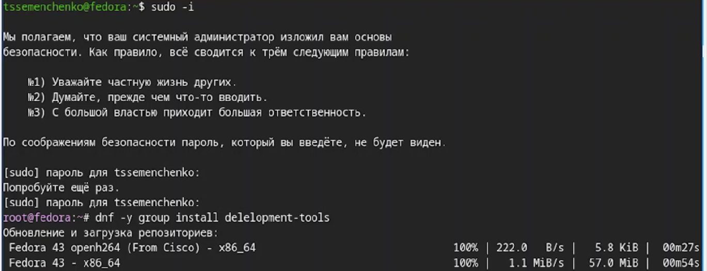
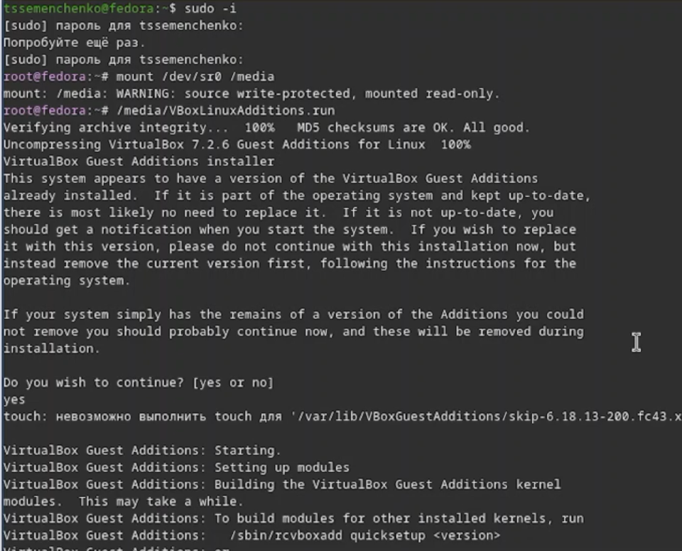
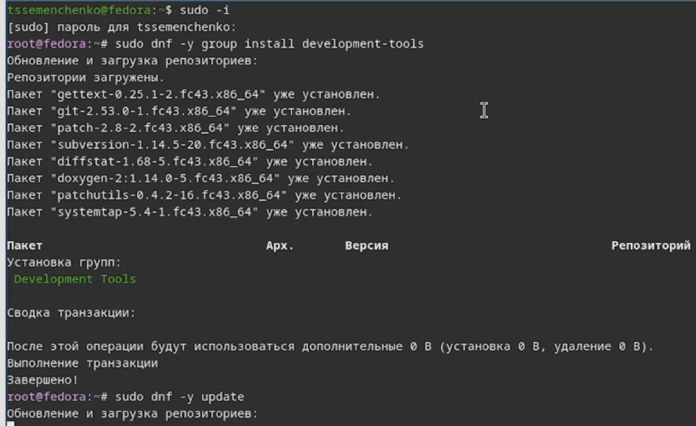
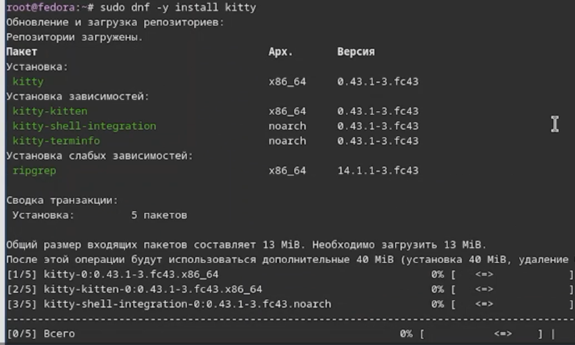
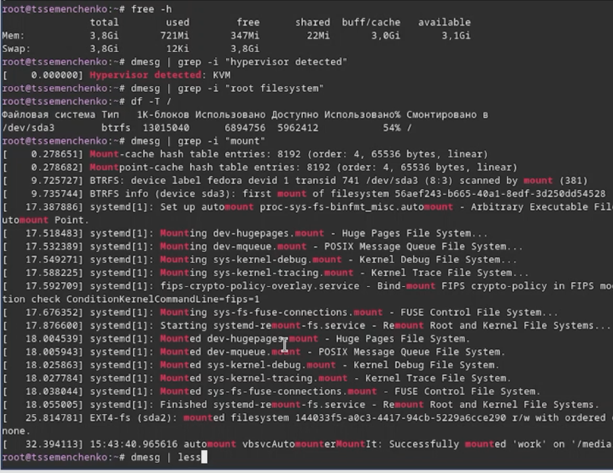

---
## Author
author:
  name: Семенченко Татьяна
  email: 1032253509@rudn.ru
  affiliation:
    - name: Российский университет дружбы народов
      country: Российская Федерация
      postal-code: 117198
      city: Москва
      address: ул. Миклухо-Маклая, д. 6
## Title
title: Установка и настройка операционной системы
subtitle: Презентация по лабораторной работе №1
license: CC BY
date: today
date-format: "YYYY-MM-DD" 
---

# Информация

## Докладчик

:::::::::::::: {.columns align=center}
::: {.column width="70%"}

  * Семенченко Татьяна Сергеевна
  * Студент
  * Факультет физико-математических и естественных наук
  * Российский университет дружбы народов им. П. Лумумбы

:::
::: {.column width="30%"}

:::
::::::::::::::

# Вводная часть

## Актуальность

- Операционная система - основа взаимодействия пользователя с компьютером
- Умение устанавнливать и настраивать ОС необходимо для каждого специалиста в области IT
- Навыки работы с виртуальными машинами позволяют изучать различные ОС без риска для основной системы

## Объект и предмет исследования

- Объект исследования: прецесс установки операционной системы 
- Предмет исследования: дистрибутив Fedora Sway и виртуальная машина VirtualBox

## Цели и задачи

**Цель**- Приобретение практических навыков установки операционной системы на виртуальную машину, настройка минимально необходимых для дальнейшей работы сервисов.

**Задачи:**
1. Установить дистрибутив Fedora Sway.
2. Выполнить базовую настройку системы.
3. Установить ПО для создания документации.
4. Проанализировать загрузку системы с помощью команды `dmesg`.

## Материалы и методы

-**Оборудование:** ПК с ОС Windows/Linux
-**ПО:** VirtualBox, образ Fedora Sway
-**Методы:** установка по руководству, настройка через терминал, анализ логов системы

# Выполнение лабораторной работы

## Создание виртуальной машины

- Создан каталог для ВМ в VirtualBox
- Нстроена ОС, подключен образ Fedora Sway для установки

## Установка операционной системы

- Выполнен запуск ВМ и установка ОС
- Наспроен профиль пользователя (логин: `tssemenchenko`)
- Заданы пароль и язык системы

## После установки: базовая настройка

{#fig-01}

## Установка пакета DKMS 

{#fig-02}

## Подключение образа диска

{#fig-03}

## Установка драйвера 

{#fig-04}

## Подключение общей папки

{#fig-05}

## Установка средства разработки

{#fig-06}

## Программы для удобства работы в консоли

{#fig-07} {#fig-08}

## Установка програмного обеспечения

{#fig-09}

## Создание конфигурации и запуск таймера

{#fig-10} {#fig-11}

## Настройки раскладки клавиатуры

{#fig-12} {#fig-13}

## Настройка клавиш для переключения клавиатуры

{#fig-15}

## Установка програмного обеспечения для создания документации

{#fig-17}

## Установка пакета pandoc-crossref

{#fig-18}

## Домашнее задание

{#fig-19}

# Выводы

## Выводы

- В ходе выполнения лабораторной работы была достигнута поставленная цель
- Приобретены навыки установки ОС  на виртуальную машину
- Освоены базовые команды настройки системы и анализа ее загрузки
- Подготовлена среда для выполнения поледующих лабораторных работ

