---
## Author
author:
  name: Семенченко Татьяна Сергеевна
  email: 1032253509@rudn.ru
  affiliation:
    - name: Российский университет дружбы народов
      country: Российская Федерация
      postal-code: 117198
      city: Москва
      address: ул. Миклухо-Маклая, д. 6

## Title
title: "Отчёт по лабораторной работе №1"
subtitle: "Архитектура компьютера"
---

# Цель работы

Приобретение практических навыков установки операционной системы на виртуальную машину, настройки минимально необходимы для дальнейшей работы сервисов.

# Задание

1. Установить дистрибутив Fedora sway на виртуальную машину.
2. Выполнить базовую настройку системы.
3. Установить програмное обеспечение для создания документации.
4. Проанализировать загрузку системы с помощью команды dmesg.
5. Оформить отчёт.

# Выполнение лабораторной работы

## Создание виртуальной машины

Создаем каталог для виртуальной машины в VirtualBox. Настраиваю операционную систему, подключаю образ Fedora Sway.

## Установка операционной системы

Запускаем машину. Настраиваем профиль: выбираем язык системы, задаем профиль, создаем пользователя по правилам наименования (tssemenchenko). Перезагружаю машину.

## После установки виртуальной машины

Выполняю вход в систему. Открываю терминал. Устанавливаю: средства разработки, обновленные пакеты, tmux. Отключаю SELinux. 
 
Переключаюсь на супер-пользователя и устанавливаю средства разработки ([рис. @fig-01]).
{#fig-01}

Устанавливаю пакет DKMS ([рис. @fig-02]).

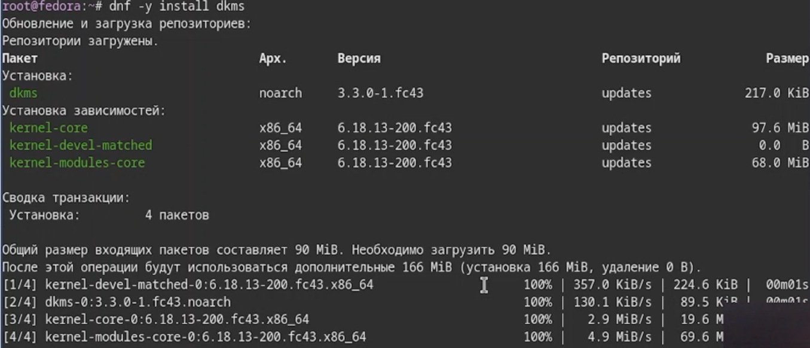{#fig-02}

В меню виртуальной машины подключаю образ диска дополнений гостевой ОС. Подмонтирую диск ([рис. @fig-03]).

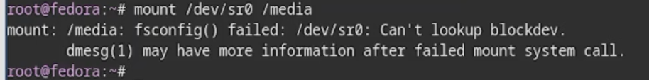{#fig-03}

Устанавливаю драйвера и перезапуская машину ([рис. @fig-04]).

{#fig-04}

Подключаю общую папку. Внутри виртуальной машины добавила своего пользователя в группу vboxsf ([рис. @fig-05]).

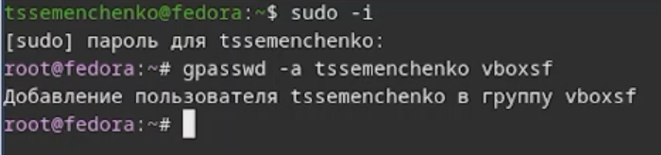{#fig-05}

Устанавливаю средства разработки и обновляю все пакеты([рис. @fig-06]).

{#fig-06}

Ввожу программы для удобства работы в консоли ([рис. @fig-07]).

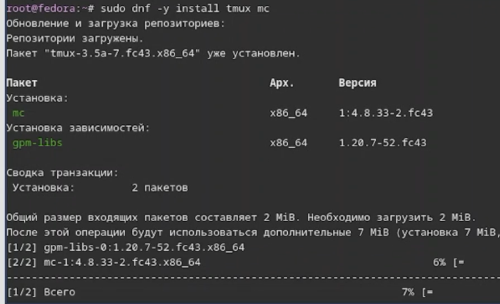{#fig-07}

{#fig-08}

Использую автоматическое обновление, устанавливаю програмное обеспечение ([рис. @fig-09]).
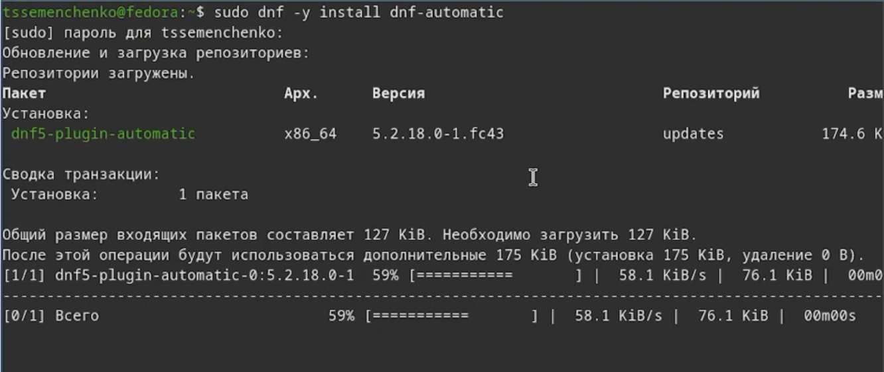{#fig-09}

Создаю необходимую конфигурацию и запускаю таймер, запускаю файл и заменяю в нем значения ([рис. @fig-10]).

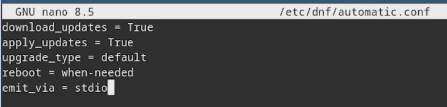{#fig-10}

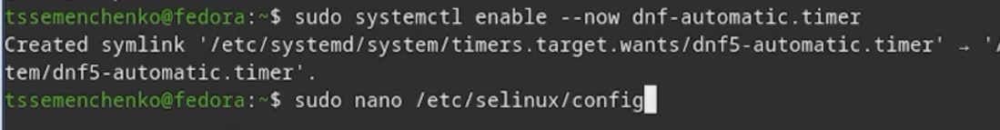{#fig-11}

## Настройки раскладки клавиатуры

Создаю конфигурационный файл и редактирую его([рис. @fig-12]).

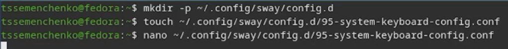{#fig-12}

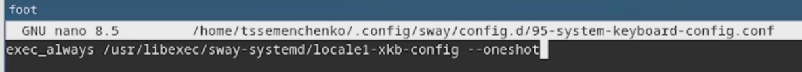{#fig-13}

Открываю файk и настраиваю клавиши для переключения раскладки клавиатуры, перезагружаю виртуальную машину ([рис. @fig-14]).

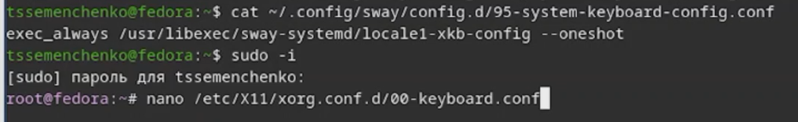{#fig-14}

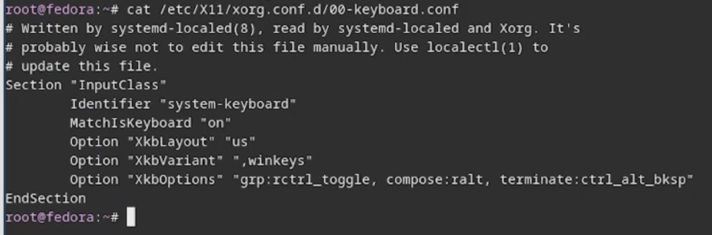{#fig-15}

## Установка имени пользователя и названия хоста

Создала пользователя (tssemenchenko), задала пароль и установила имя хоста. Проверила, что имя хоста установлено верно ([рис. @fig-16]).

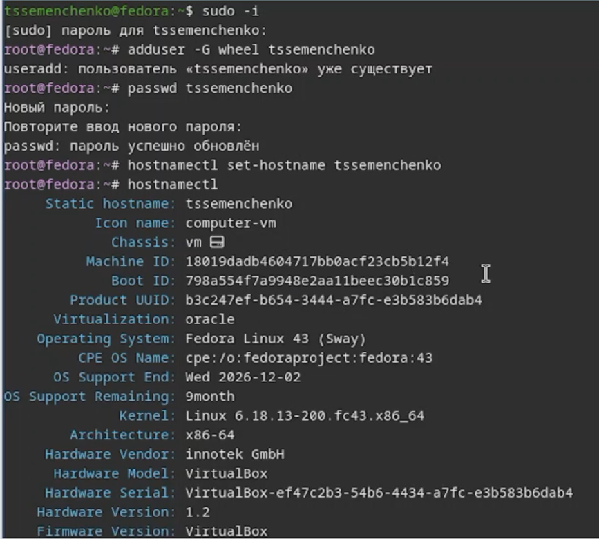{#fig-16}

## Установка программного обеспечения для создания документации

Устанавливаю pandoc для работы с языком разметки Markdown ([рис. @fig-17]).

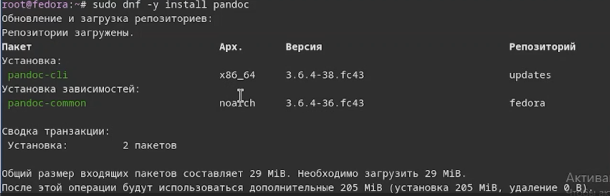{#fig-17}

Установила пакет pandoc-crossref ([рис. @fig-18]).

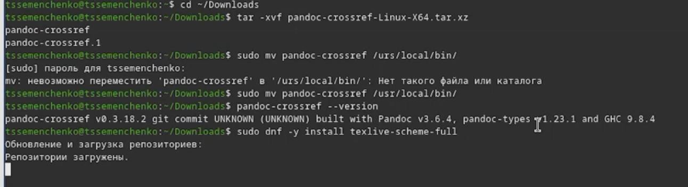{#fig-18}

## Домашнее задание 

Посмотрела вывод команды dmegs | less, получила нужную мне информацию ([рис. @fig-19]).

{#fig-19}

# Выводы

В ходе данной лабораторной работы я приобрела практические навыки установки операционной системы на виртуальную машину и настройки необходимых для работы сервисов.

