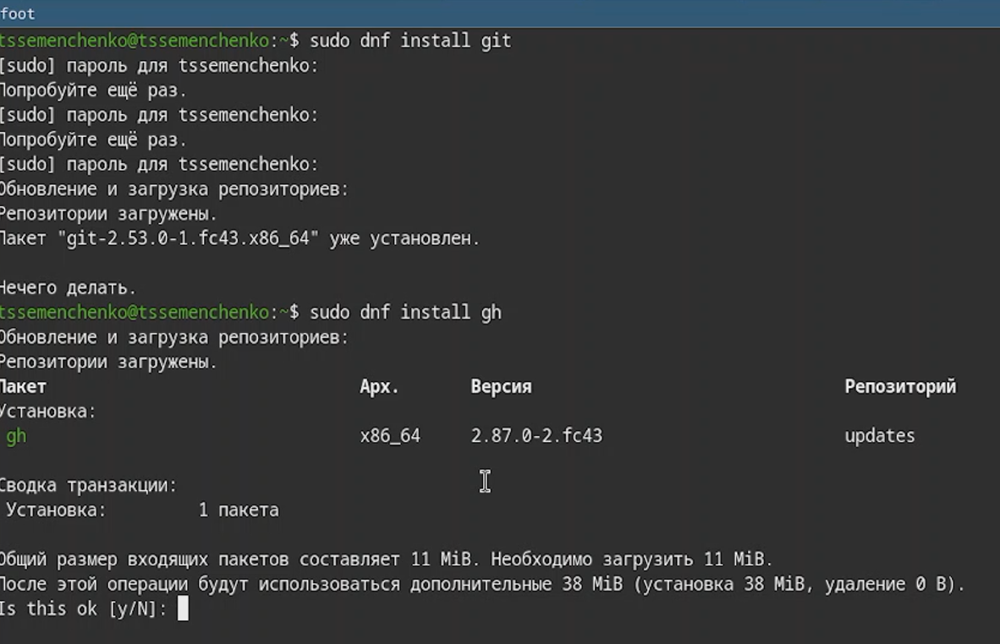
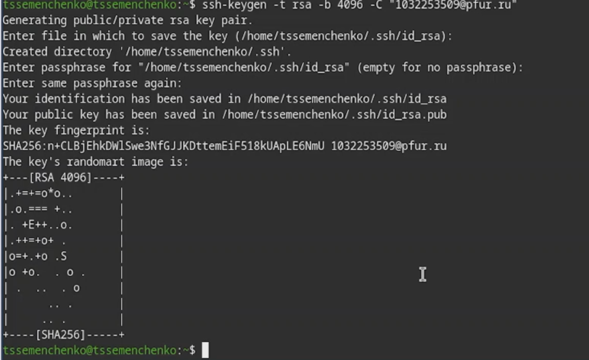
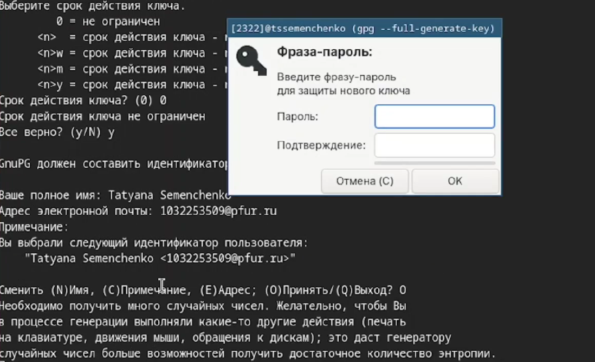
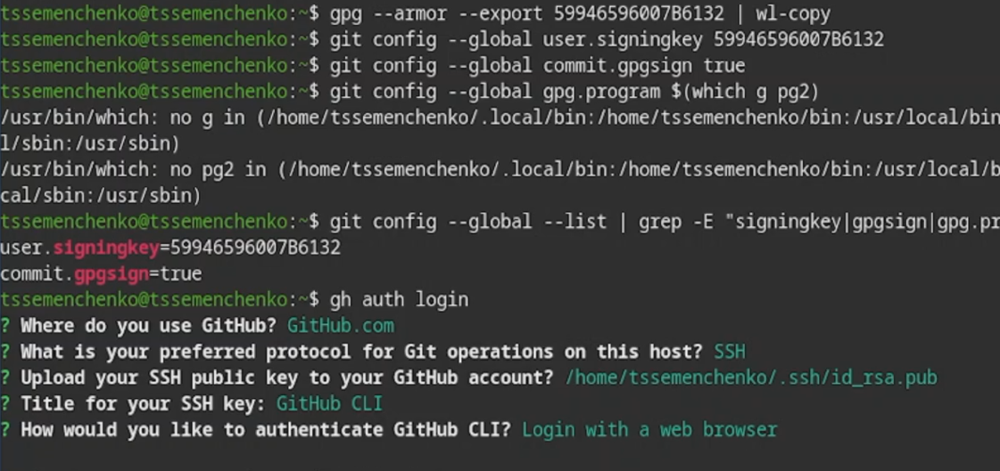
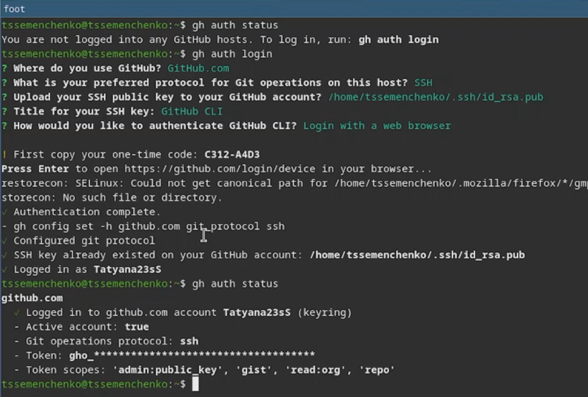
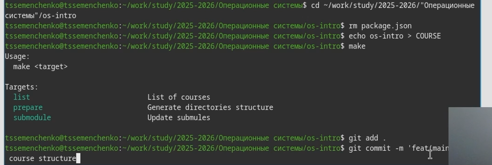
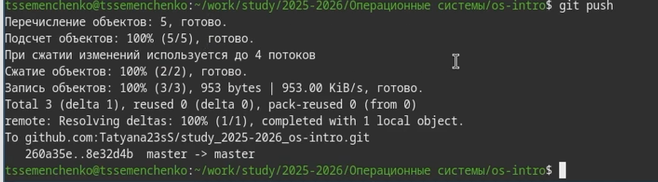

---
## Author
author:
  name: Семенченко Татьяна Сергеевна
  email: 1032253509@rudn.ru
  affiliation:
    - name: Российский университет дружбы народов
      country: Российская Федерация
      postal-code: 117198
      city: Москва
      address: ул. Миклухо-Маклая, д. 6
## Title
title: Система контроля версий Git
subtitle: Презентация по лабораторной работе №2
license: CC BY
date: today
date-format: "YYYY-MM-DD" 
---

# Информация

## Докладчик

:::::::::::::: {.columns align=center}
::: {.column width="70%"}

  * Семенченко Татьяна Сергеевна
  * Студент НКАбд-05-25, 1032253509
  * Факультет физико-математический и естественных наук
  * Российский университет дружбы народов им. П. Лумумбы

:::
::: {.column width="30%"}

:::
::::::::::::::

# Вводная часть

## Актуальность

- Системы контроля версий необходимы для совместной работы на проектами
- Git - наиболее популярная система контроля версий
- Умение работать с Git и GitHub обязательно для современного разработчика
- Безопасность кода обеспечивается подписыванием коммитов

## Объект и предмет исследования

- Объект исседования: система контроля версий Git
- Предмет исследования: настройка Git, создание ключей SSH и GPG, работа с GitHub

## Цели и задачи

**Цель**- изучить идеологию и применение средств контроля версий. Освоить умения по работе с git

**Задачи:**
1. Создать базовую конфигурацию для работы с git
2. Создать ключи SSH и GPG
3. Настроить подписи git
4. Залогиниться на GitHub
5. Созлать локальный каталог для выполнения работ

## Материалы и методы

-**Оборудование:** ПК с ОС Windows/Linux
-**ПО:** VirtualBox, образ Fedora Sway
-**Методы:** настройка через терминал, генерация ключей, работа с удаленным репозиторием

# Выполнение лабораторной работы

## Установка git

{#fig-01}

## Имя владельца репозитория

{#fig-02}

## Генерация ключа SSH

{#fig-03} {#fig-04}

## Генерация GPG ключа

{#fig-05} {#fig-06}

## Список ключей

{#fig-07}

## Копирование в буфер обмена

{#fig-08} {#fig-10}

## Создание каталога

{#fig-11}

## Каталог курса

{#fig-12}

## Отправка изменений 

{#fig-13}

# Выводы

## Выводы

В результате выполнения лабораторной работы я приобрела навыки, необходимые для работы с git, настроила каталоги курса для дальнейшей работы, создала SSH и GPG ключи и авторизовалась в gh.
