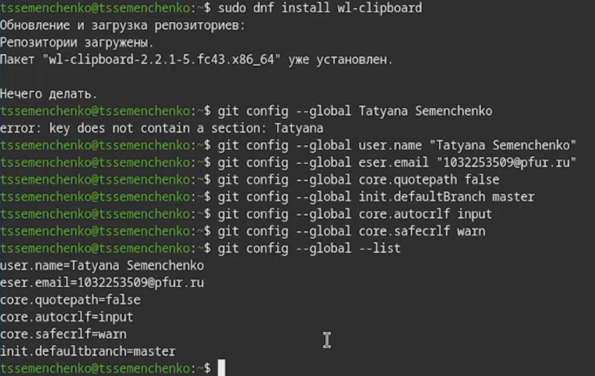
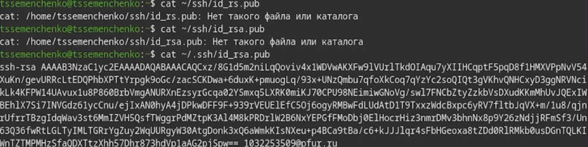
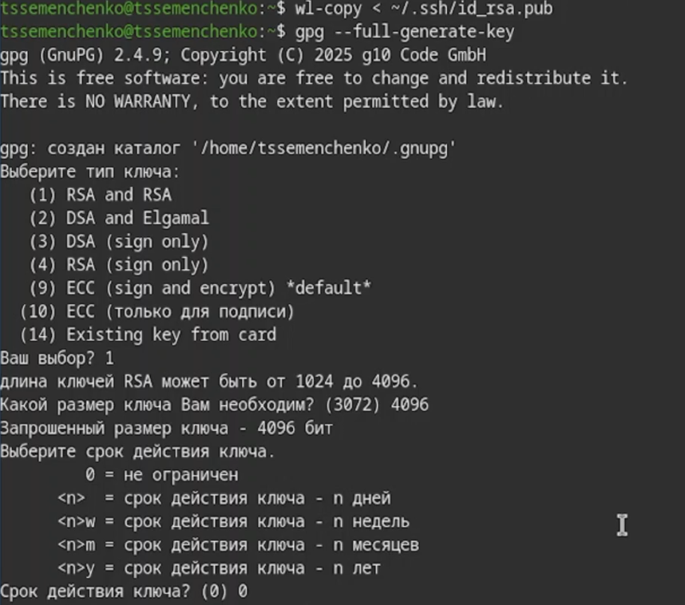
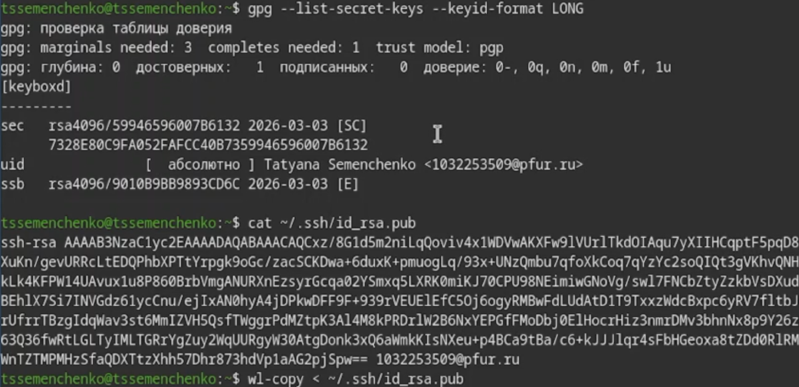
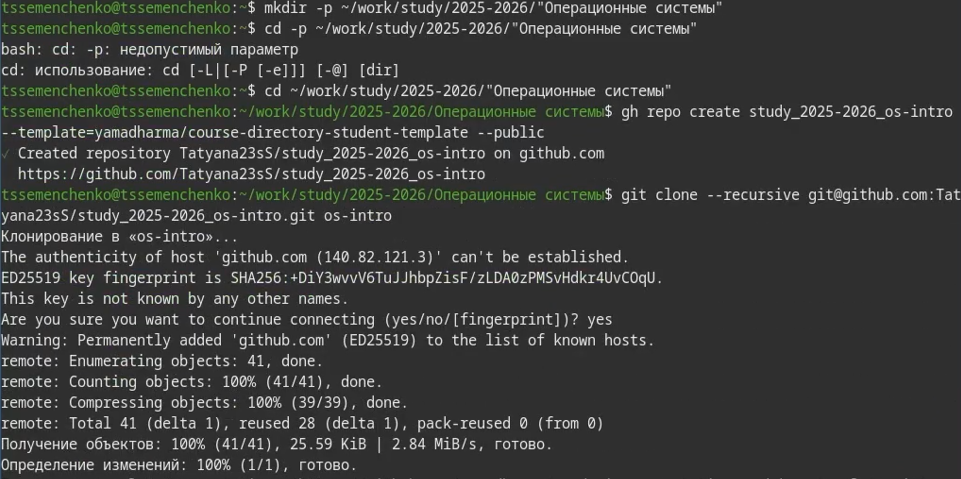

# Цель работы

Целью работы является изучение работы и применение средств контроля версий и освоения умения по работе с git.

# Задание

Создать базовую конфигурацию для работы с git, ключ ssh, ключ gpg, подписи git, локальный каталог для выполнения и прикрепления заданий по предмету.

# Теоретическое введение

Git — это распределённая система контроля версий, которая позволяет отслеживать изменения в файлах и координировать работу над проектами. Основные понятия:
 
-**Репозиторий (repository)** - хранилище проекта и всей истории его изменений.
 
-**Коммит (commit)** - «снимок» состояния файлов в определённый момент времени.
 
-**SSH-ключи** - используются для установления безопасного соединения с GitHub без необходимости вводить пароль при каждом взаимодействии.
 
-**GPG-ключи** - используются для подписи коммитов, что позволяет подтвердить их авторство и гарантировать, что они не были изменены.

# Выполнение лабораторной работы

1) Для начала работы переключимся на суперпользователя при помощи команды `sudo -i`. Установим git при помощи команды `dnf install git`. Установим gh при помощи команды `dnf install gh` ([рис. @fig-001]).

{#fig-001 width=70%}

2) Задаем имя и email владельца репозитория. Насторим utf-8 в выводе сообщений в git. Задаем имя начальной ветки (master). Настроим параметры autocrlf и safecrlf ([рис. @fig:002]).
{#fig-002 width=70%}

3) Сгенерируем ключ ssh по алгоритму rsa с ключом размером 4096 бит.([рис. @fig-003]).

{#fig-003 width=70%}

4) Смотрю содержимое файла([рис. @fig-004]).

{#fig-004 width=70%}

5) Генерируем gpg ключ для подписи коммитов ([рис. @fig-005]).

{#fig-005 width=70%}

{#fig-006 width=70%}

6) Выведем список ключей и скопируем отпечаток приватного ключа([рис. @fig-007]).

{#fig-007 width=70%}

7)  Скопируем сгенерированный ключ в буфер обмена. Используя введенный email, укажем git применять его при подписи коммитов.
    Авторизуемся в Github через gh командой `gh auth login`([рис. @fig-008]).

{#fig-008 width=70%}

{#fig-009 width=70%}

 8) Создадим каталог для работы и перейдем в него. Создаем репозиторий на основе шаблона. Выполняем клонирование репозитория ([рис. @fig-010]).
 
{#fig-010 width=70%} 

9) Переходим в каталог курса. Удаляю лишние файлы. Создаю необходимые каталоги для лабораторных работ. Отправляю созданные файлы на сервер. Для этого сначала выполняю комманду `git add`, чтобы добавить все изменения в индекс ([рис. @fig-011]).

{#fig-011 width=70%}

10) Отправим изменения в удаленный репозиторий ([рис. @fig:012]).

{#fig-012 width=70%}

# Выводы

В результате выполнения лабораторной работы я приобрела навыки, необходимые для работы с git, настроила каталоги курса для дальнейшей работы, создала ssh и gpg ключи и авторизовалась в gh.

# Список литературы

