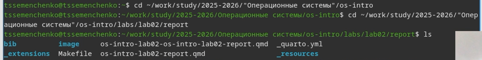
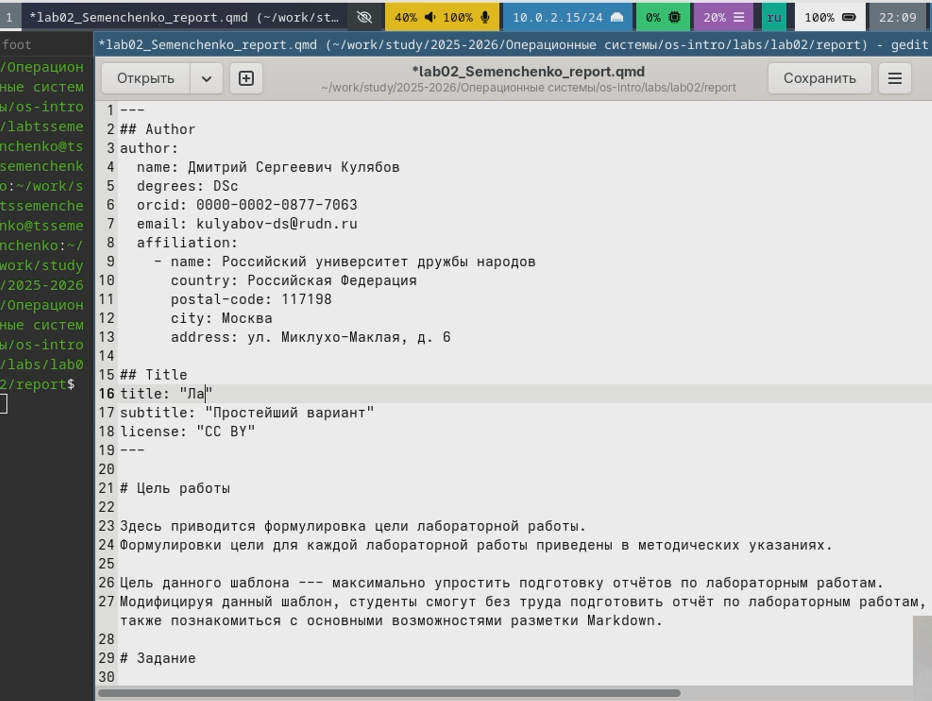
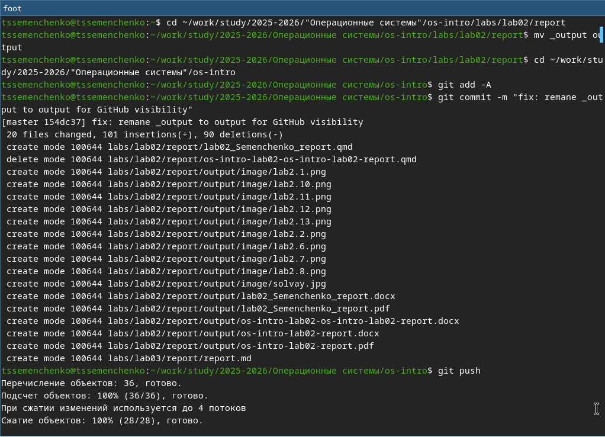

---
## Author
author:
  name: Семенченко Татьяна Сергеевна
  email: 1032253509@rudn.ru
  affiliation:
    - name: Российский университет дружбы народов
      country: Российская Федерация
      postal-code: 117198
      city: Москва
      address: ул. Миклухо-Маклая, д. 6
## Title
title: Оформление отчёта в Markdown
subtitle: Презентация по лабораторной работе №3
license: CC BY
date: today
date-format: "YYYY-MM-DD"
---

# Информация

## Докладчик

:::::::::::::: {.columns align=center}
::: {.column width="70%"}

  * Семенченко Татьяна Сергеевна
  * Студент группы НКАбд-05-25, 1032253509
  * Факультет физико-математических и естественных наук
  * Российский университет дружбы народов им. П. Лумумбы
  
:::
::: {.column width="30%"}

:::
::::::::::::::

# Вводная часть

## Актуальность

- Markdown — удобный язык разметки для оформления документации
- Quarto позволяет конвертировать Markdown в различные форматы
- Автоматизация создания отчетов экономит время
- Единый исходный код для разных целевых форматов
 
## Объект и предмет исследования
 
- Объект исследования: процесс оформления отчетов
- Предмет исследования: язык разметки Markdown и система Quarto
 
## Цели и задачи
 
**Цель:** Научиться оформлять отчеты с помощью языка разметки Markdown.
 
**Задачи:**
 
1. Создать отчет по предыдущей лабораторной работе в формате Markdown
2. Скомпилировать отчет в различные форматы с помощью Quarto
3. Получить файлы отчета в форматах PDF и DOCX
4. Получить файлы презентации в форматах PDF и HTML
 
## Материалы и методы
 
- **Оборудование:** ПК с ОС Linux (Fedora Sway)
- **ПО:** Quarto, Pandoc, LaTeX
- **Методы:** Написание в Markdown, компиляция через Makefile

# Выполнение лабораторной работы

## Обновление репозитория

{#fig-01} 

## Создание копии файла

{#fig-02} 

## Открытие файла

{#fig-03} 

## Редактирование отчёта в Markdown

{#fig-04} 

## Конвертация и отправка на GitHub

{#fig-05} 

# Выводы

## Выводы

В ходе выполнения лабораторной работы были получены навыки работы в Markdown и навыки оформления отчётов, а также работа с конвертацией файла в pdf и docx через quarto.

