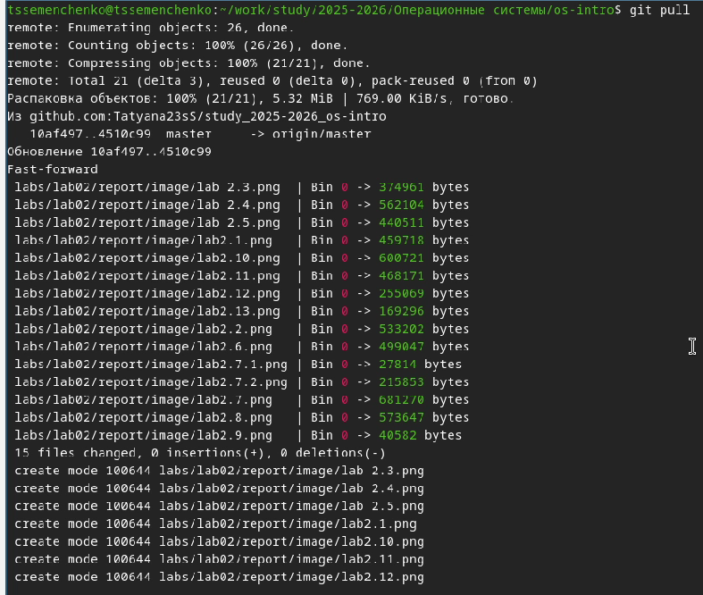
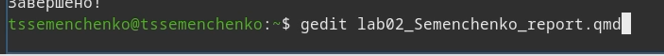

---
## Author
author:
  name: Семенченко Татьяна Сергеевна
  email: 1032253509@rudn.ru
  affiliation:
    - name: Российский университет дружбы народов
      country: Российская Федерация
      postal-code: 117198
      city: Москва
      address: ул. Миклухо-Маклая, д. 6

## Title
title: "Отчёт по лабораторной работе №3"
subtitle: "Архитектура компьютера"
license: "CC BY"
---

# Цель работы

Научиться оформлять отчеты с помощью языка разметки Markdown.

# Задание

Сделать отчет по предыдущей лабораторной работе в формате Markdown.

# Выполнение лабораторной работы

## Создание отчета

Снимки экрана по выполнению лабораторной №2 заранее прикрепила на GitHub и обновила репозиторий ([рис. @fig-01]).

{#fig-01}

Перешла в папку репорт и просмотрела файлы, которые там есть. Создала копию файла `os-intro-lab02-report.qmd` ([рис. @fig-02]).

{#fig-02}

{#fig-03}

Редактирую шаблон отчета под себя в консоли Linux ([рис. @fig-04]).

{#fig-04}

Ввожу команду make и конвертирую отчет в форматы pdf и docx. Переименовываю папку output и отправляю файлы в репозиторий на Github ([рис. @fig-05]).

{#fig-05}

# Выводы

В ходе работы получены навыки работы в Markdown и навыки оформления отчётов, а также работа с конвертацией файла в pdf и docx через quarto.

