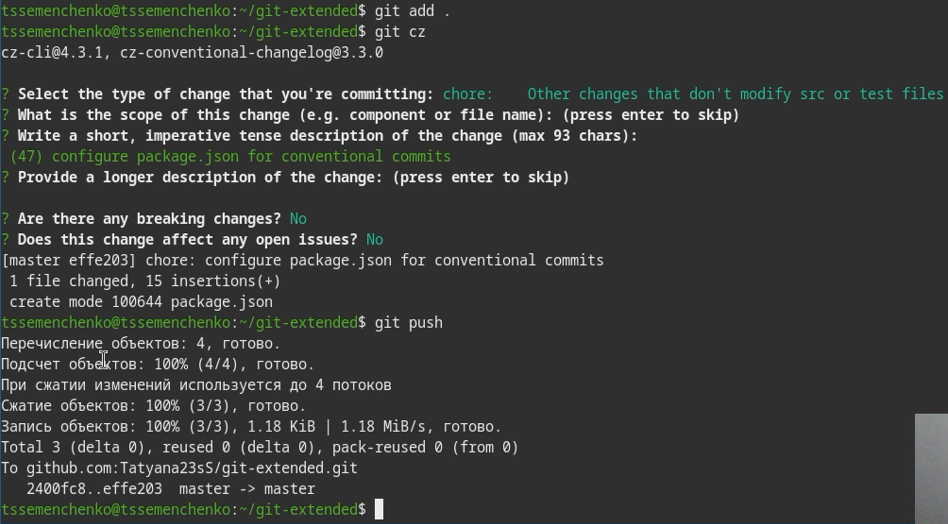
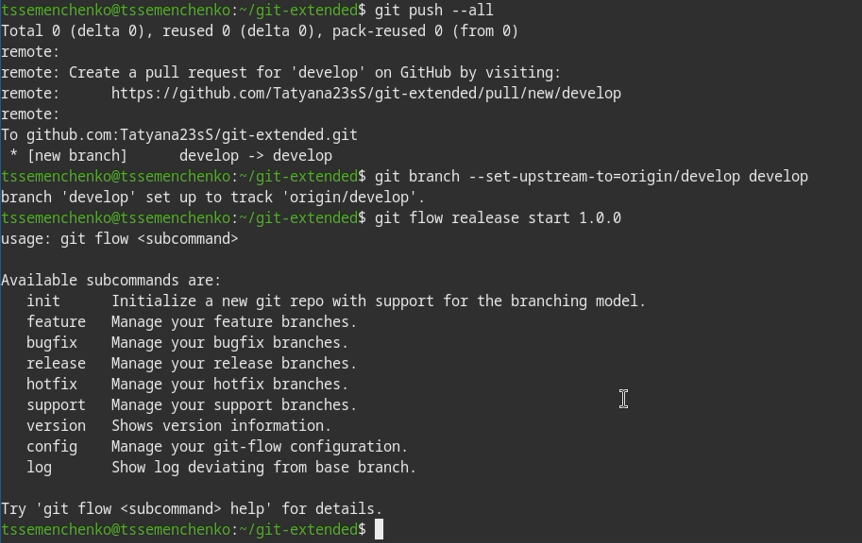
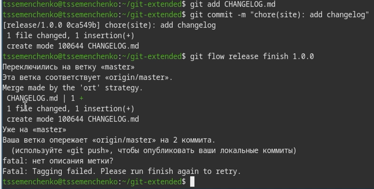
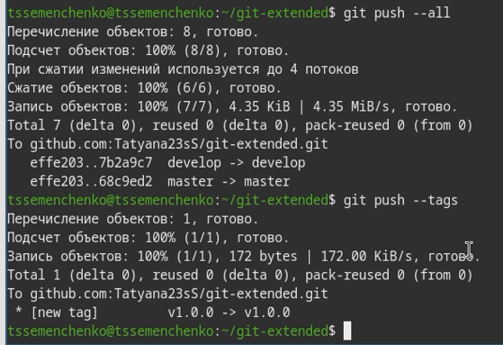
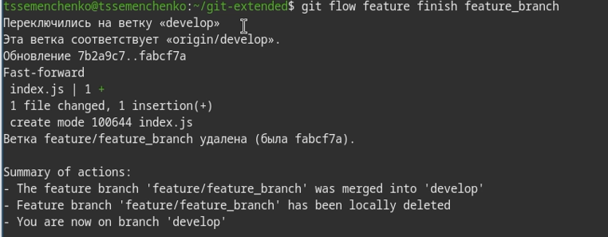

---
## Author
author:
  name: Семенченко Татьяна Сергеевна
  email: 1032253509@rudn.ru
  affiliation:
    - name: Российский университет дружбы народов
      country: Российская Федерация
      postal-code: 117198
      city: Москва
      address: ул. Миклухо-Маклая, д. 6
## Title
title: Работа с репозиториями Git и Gitflow
subtitle: Презентация по лабораторной работе №4
license: CC BY
date: today
date-format: "YYYY-MM-DD"
---

# Информация

## Докладчик

:::::::::::::: {.columns align=center}
::: {.column width="70%"}

  * Семенченко Татьяна Сергеевна
  * Студент группы НКАбд-05-25, 1032253509
  * Факультет физико-математических и естественных наук
  * Российский университет дружбы народов им. П. Лумумбы

:::
::: {.column width="30%"}

:::
::::::::::::::

# Вводная часть

## Актуальность

- Git — основной инструмент для управления версиями кода
- GitFlow обеспечивает структурированный подход к разработке
- Правильная работа с репозиториями критична для командной разработки
- Автоматизация создания релизов упрощает выпуск версий
 
## Объект и предмет исследования
 
- Объект исследования: процесс работы с репозиториями Git
- Предмет исследования: методология GitFlow и инструменты для работы с релизами
 
## Цели и задачи
 
**Цель:** Получение навыков правильной работы с репозиториями git.
 
**Задачи:**
 
1. Установить необходимое программное обеспечение
2. Создать репозиторий git-extended на GitHub
3. Выполнить синхронизацию локального репозитория с GitHub
4. Настроить конфигурацию коммитов
5. Настроить git-flow
6. Создать первый и второй релизы
 
## Материалы и методы
 
- **Оборудование:** ПК с ОС Linux (Fedora Sway)
- **ПО:** Git, git-flow, Node.js, npm
- **Методы:** Работа с ветками, создание релизов, семантическое версионирование

# Выполнение лабораторной работы

## Установка програмного обеспечения

- Устанавливаю git-flow, Nodejs, npm.

## Создание репозитория Git

{#fig-05}

## Настройка conventional commits

{#fig-08}

## Редактирование файла 

{#fig-09}

## Добавление файла в репозиторий

{#fig-11}

## Процесс работы с Gitflow

{#fig-12}

## Создание первого релизф 

{#fig-13}

## Работа с репозиторием Git

{#fig-14} {#fig-15}

## Отправиление изменений на GitHub 

{#fig-16}

## Создание релизф с использованием gh

{#fig-17}

## Завершение работы над функциональностью

{#fig-18}

## Создание релиза с версией 1.2.3

{#fig-19}

## Завершение релиза и отправка изменений на GitHub 

{#fig-20}

# Выводы

## Выводы

В ходе выполнения лабораторной работы получила навыки правильной работы с резозиториями Git.

