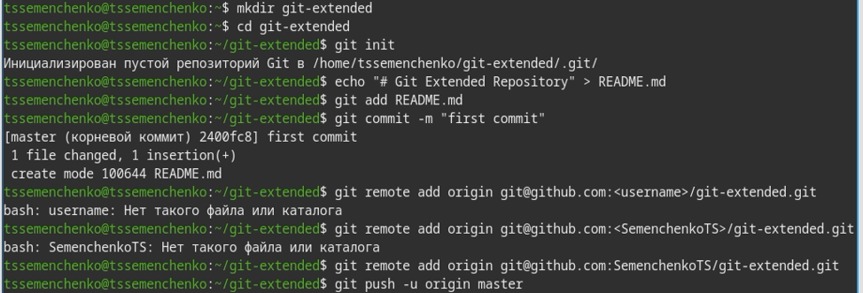
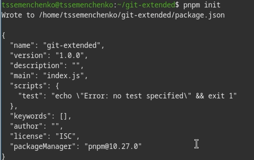
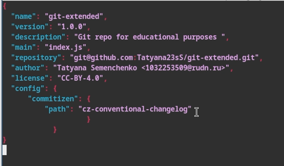
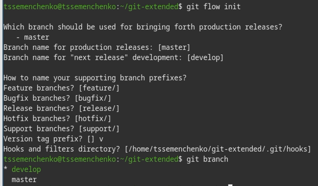
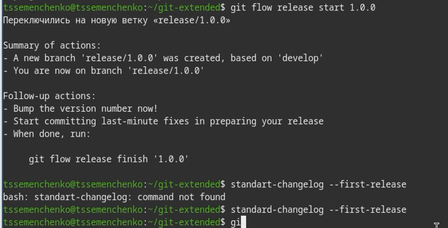
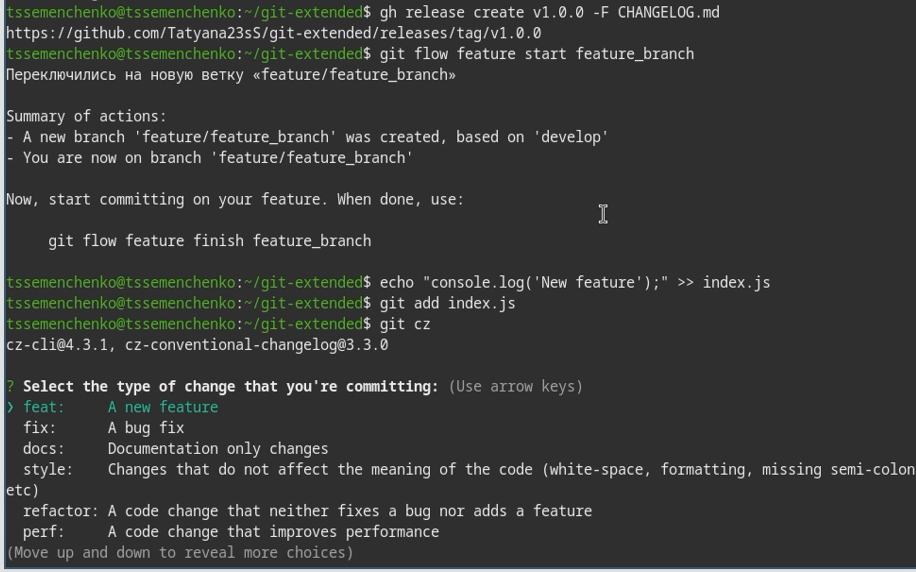
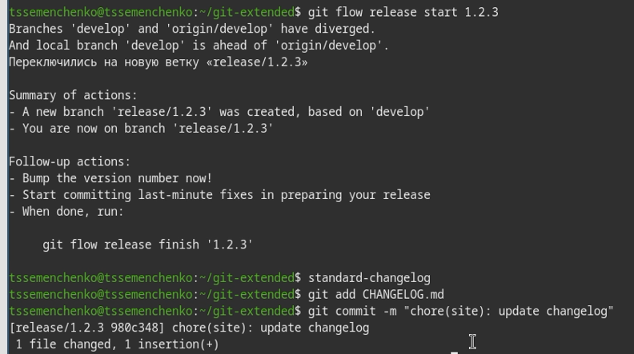
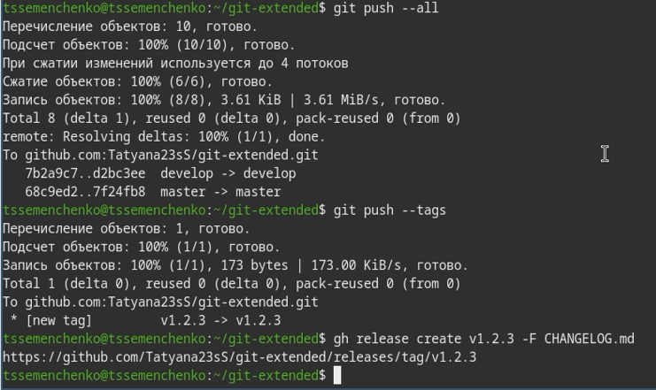

---
## Author
author:
  name: Семенченко Татьяна Сергеевна
  email: 1032253509@rudn.ru
  affiliation:
    - name: Российский университет дружбы народов
      country: Российская Федерация
      postal-code: 117198
      city: Москва
      address: ул. Миклухо-Маклая, д. 6

## Title
title: "Отчё по лабораторной работе №4"
subtitle: "Архитектура компьютера"
license: "CC BY"
---

# Цель работы

Получение навыков правильной работы с репозиториями git.

# Задание

Выполнение работы для тестового репозитория. Преобразовать рабочий репозиторий в репозиторий с git-flow и conventional commit.

# Выполнение лабораторной работы

## Установка програмного обеспечения. 

Устанавливаю git-flow, Nodejs, npm.

## Создание репозитория git.

Создаю репозиторий git-extented на github. При использовании библиотеки расширений git-flow инициилизировала структуру с помощью `git flow init`, создаю первый коммит и подключаю его к удаленному репозиторию ([рис. @fig-05]).

{#fig-05}

## Настройка conventional commits

Инициализирую npm пакет ([рис. @fig-08]).

{#fig-08}

Открываю и редактирую файл package.json ([рис. @fig-09]).

{#fig-09}

Добавляю файл в репозииторий и делаю коммит, отправляю изменения на GitHub ([рис. @fig-11]).

{#fig-11}

## Процесс работы с Gitflow

Инициализирую структуру и проверяю текущую ветку ([рис. @fig-12]).

{#fig-12}

Отправляю все ветки в удаленный репозиторий и устанавливаю связи между локальной и удаленной веткой develop, создаю первый релиз ([рис. @fig-13]).

{#fig-13}

## Работа с репозиторием Git

Создала релизную ветку, создала журнал изменений для первого релиза, Добавала CHENGELOG.md в репозиторий, завершила релиз ([рис. @fig-14]).

{#fig-14}

{#fig-15}

Отправила изменения на GitHub ([рис. @fig-16]).

{#fig-16}

Создаю релиз с использованием gh, создаю ветки для новой функциональности, вношу изменения, использую conventional commit ([рис. @fig-17]).

{#fig-17}

Завершаю работу над функциональностью ([рис. @fig-18])

{#fig-18}

Создаю релиз с версией 1.2.3, обновляю журнал изменений, добавляю обновленный CHANGELOG.md ([рис. @fig-19]).

{#fig-19}

Завершаю релиз и отправляю изменения на GitHub ({рис. @fig-20}).

{#fig-20}

# Выводы

Получила навыки правильной работы с репозиториями Git. 

