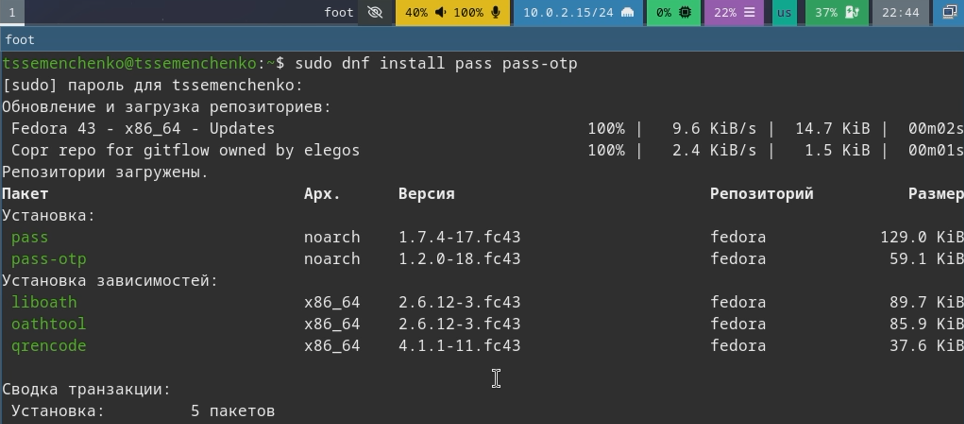
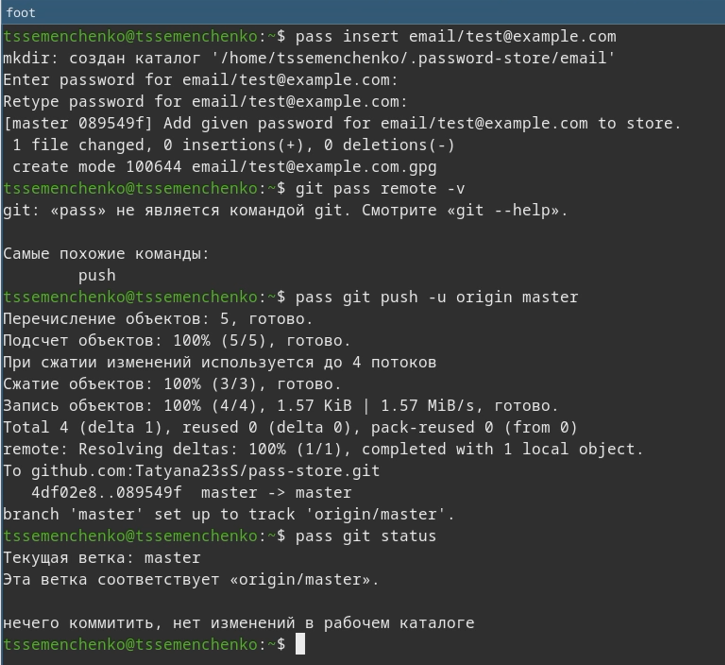
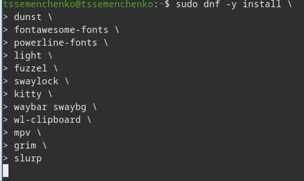
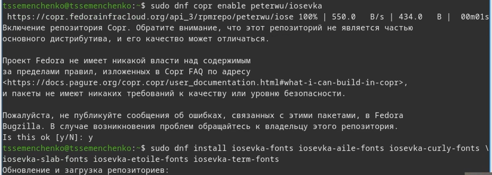
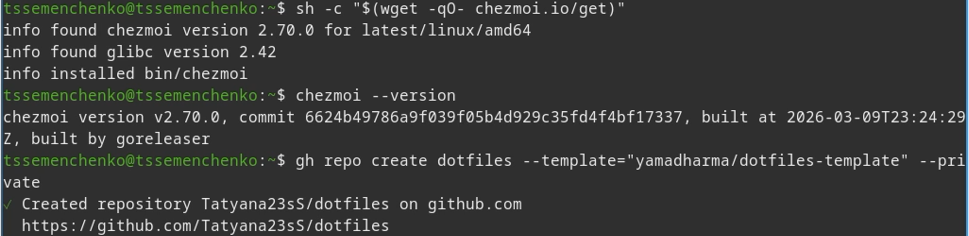
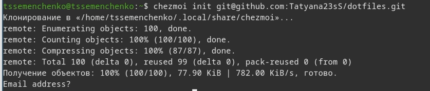
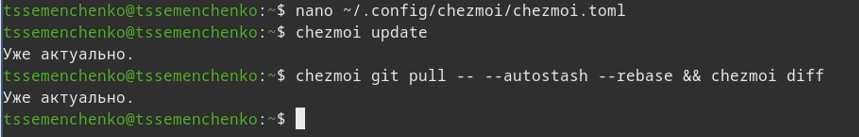

---
## Author
author:
  name: Семенченко Татьяна Сергеевна
  email: 1032253509@rudn.ru
  affiliation:
    - name: Российский университет дружбы народов
      country: Российская Федерация
      postal-code: 117198
      city: Москва
      address: ул. Миклухо-Маклая, д. 6
## Title
title: Менеджер паролей pass и система управления конфигурациями chezmoi
subtitle: Презентация по лабораторной работе №5
license: CC BY
date: today
date-format: "YYYY-MM-DD"
---

# Информация

## Докладчик

:::::::::::::: {.columns align=center}
::: {.column width="70%"}

  * Семенченко Татьяна Сергеевна
  * студент, НКАбд-05-25, 1032253509
  * факультет физико-математических и естественных наук
  * Российский университет дружбы народов им. П. Лумумбы

:::
::: {.column width="30%"}

:::
::::::::::::::

# Цель работы
 
Настройка рабочей среды: изучение менеджера паролей pass и системы управления файлами конфигурации chezmoi.
 
# Задание
 
1. Установить и настроить менеджер паролей pass
2. Установить и настроить chezmoi для управления файлами конфигурации
3. Подключить репозиторий с dotfiles и применить конфигурацию

# Выполнение лабораторной работы

## Установка pass и gopass

{#fig-01}

## Установка pass и gopass

{#fig-02}

## Настройка GPG-ключа 

{#fig-03}

## Инициализация хранилища и настройка git
 
{#fig-04}
 
## Добавление пароля и синхронизация 
 
{#fig-05}
 
## Настройка browserpass 
 
{#fig-06}
 
## Установка дополнительного программного обеспечения
 
{#fig-07}
 
## Установка шрифтов iosevka
 
{#fig-08}
 
## Установка chezmoi и создание репозитория на GitHub 
 
{#fig-09}
 
## Подключение репозитория к системе

{#fig-10}
 
## Ежедневные операции с chezmoi 

{#fig-11} {#fig-12} 
 
# Выводы

## Выводы
 
В ходе работы были освоены инструменты для настройки рабочей среды: менеджер паролей pass и система управления файлами конфигурации chezmoi. Выполнена настройка и синхранизация файлов.

