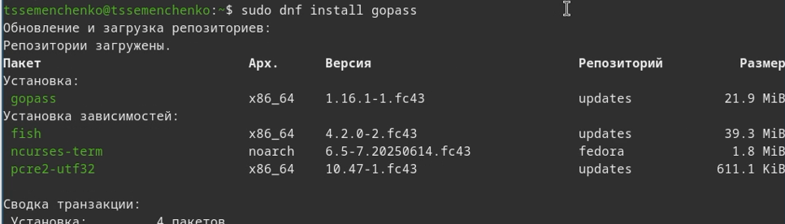
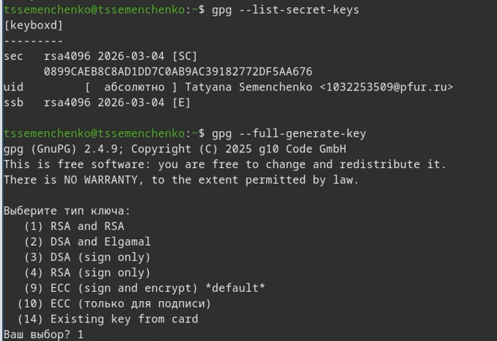
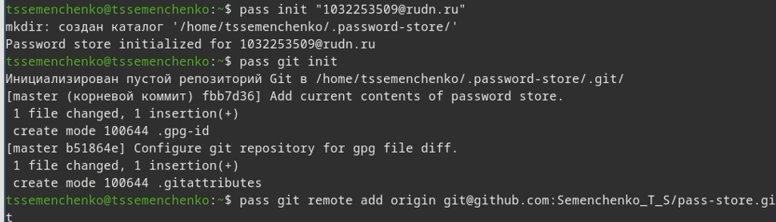
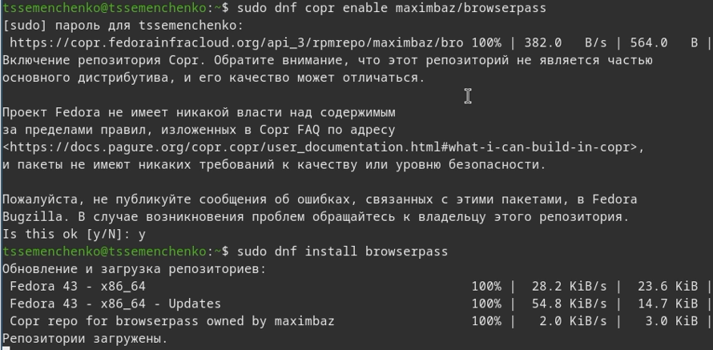
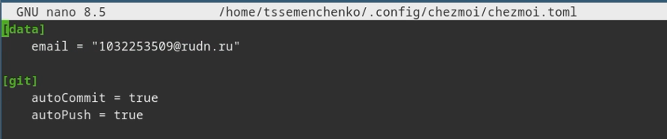

---
## Author
author:
  name: Семенченко Татьяна Сергеевна
  email: 1032253509@rudn.ru
  affiliation:
    - name: Российский университет дружбы народов
      country: Российская Федерация
      postal-code: 117198
      city: Москва
      address: ул. Миклухо-Маклая, д. 6

## Title
title: "Отчёт по лабораторной работе №5"
subtitle: "Архитектура компьютеров и операционные системы."
license: "CC BY"
---

# Цель работы

Настройка рабочей среды: изучение менеджера паролей pass и системы управления файлами конфигурации chezmoi.

# Задание

1. Установить и настроить менеджер паролей pass.
2. Установить и настроить chezmoi  для управления файлами конфигурации.
3. Подключить репозиторий с dotfiles и применить конфигурацию.

# Выполнение лабораторной работы

# Менеджер паролей pass

## Установка pass и gopass

Установлены пакеты pass, pass-otp для работы с менеджером паролей, а также gopass - реализация менеджера паролей на Go с дополнительными функциями ([рис. @fig-01]).

{#fig-01}

{#fig-02}

## Настрока GPG-ключа 

Выполнила проверку наличия gpg-ключа и создала новый ключ для шифрования хранилища паролей ([рис. @fig-03]).

{#fig-03}

## Инициализация хранилища и настройка git

Инициализирую хранилище паролей с использованием GPG-ключа, создала git-структуру и подключила удаленный репозиторий на GitHub ([рис. @fig-04]).

{#fig-04}

## Добавление пароля и синхронизация 

Добавила тестовый пароль в хранилище, выполнила синхронизацию с удаленным репозиторием на GitHub ([рис. @fig-05]).

{#fig-05}

## Настройка browserpass 

Для взаимодействия с браузером подключила репозиторий copr и установила пакет browserpass, обеспечивающий интерфейс native messaging ([рис. @fig-06]).

{#fig-06}

# Управление файлами конфигурации

## Установка дополнительного программного обеспечения

Установила дополнительные пакеты, необходимые для работы рабочей среды ([рис. @fig-07]).

{#fig-07}

## Установка шрифтов iosevka

Подключила репозиторий и установила шрифты семейства iosevka ([рис. @fig-08]).

{#fig-08}

## Установка chezmoi и создание репозитория на GitHub 

Установила бинарный файл chezmoi с помощью скрипта, а также создала приватный репозиторий dotfiles на GitHub на основе шаблона ([рис. @fig-09]).

{#fig-09}

## Подключение репозитория к системе

Выполнила инициализацию chezmoi с репозиторием dotfiles и применила изменения в домашнем каталоге ([рис. @fig-10]).

{#fig-10}

## Ежедневные операции с chezmoi 

Настроила автоматическую фиксацию и отправила изменения. Выполнила проверку синхронизации: получила последние изменения из репозитория и применила к домашнему каталогу ([рис. @fig-11]).

{#fig-11}

{#fig-12} 

# Выводы

В ходе работы были освоены инструменты для настройки рабочей среды: менеджер паролей pass и система управления файлами конфигурации chezmoi. Выполнена настройка и синхранизация файлов.

