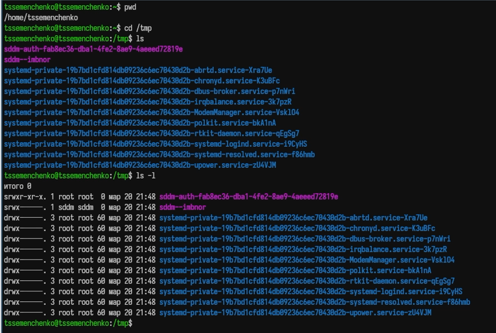
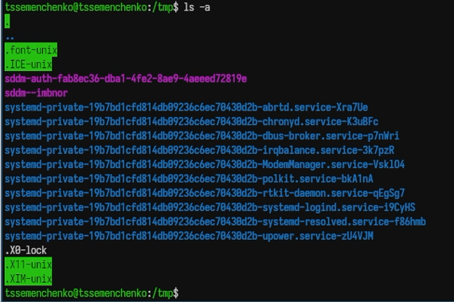
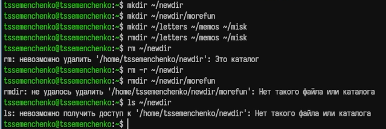
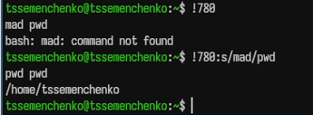

---
## Author
author:
  name: Семенченко Татьяна Сергеевна
  email: 1032253509@rudn.ru
  affiliation:
    - name: Российский университет дружбы народов
      country: Российская Федерация
      postal-code: 117198
      city: Москва
      address: ул. Миклухо-Маклая, д. 6
## Title
title: Взаимодействие с системой через командную строку
subtitle: Презентация для лабораторной работы №6
license: CC BY
date: today
date-format: "YYYY-MM-DD"
---

# Информация

## Докладчик

:::::::::::::: {.columns align=center}
::: {.column width="70%"}

  * Семенченко Татьяна Сергеевна
  * студент, НКАбд-05-25, 1032253509
  * факультет физико-математических и естественных наук
  * Российский университет дружбы народов им. П. Лумумбы

:::
::: {.column width="30%"}

:::
::::::::::::::

# Цель работы

Преобретение практичских навыков взаимодействия пользователя с системой посредством командной строки. 

# Задание

Выполнить ряд действий с командами cd, ls, mkdir, rm, history, man для освоения работы в командной строке Unix.

# Выполнение лабораторной работы

## Определение полного имени домашнего каталога

{#fig-01}

## Работа с каталогами /tmp и /tmp/spool

{#fig-02}

## Использование ls с разными операндами

{#fig-03}

## Проверка наличия каталога cron в /var/spool

{#fig-04}

## Создание каталога newdir и подкаталога morefun

{#fig-05}

## Изучение опций команд через man 

{#fig-06}

## Команда man для просмотра описания следующих команд cd, pwd, mkdir, rmdir, rm

{#fig-07}

## Работа с историей команд

{#fig-08}

# Выводы

## Выводы

В ходе работы приобретены практические навыки взаимодействия с системой Unix через командную строку, освоены основные команды для навигации, создания и удаления файлов и катлогов, работы с историей и получения справки.

