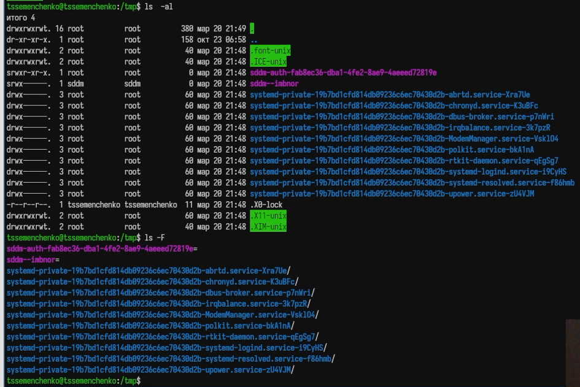
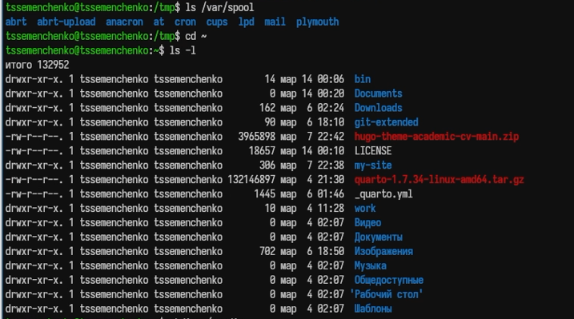
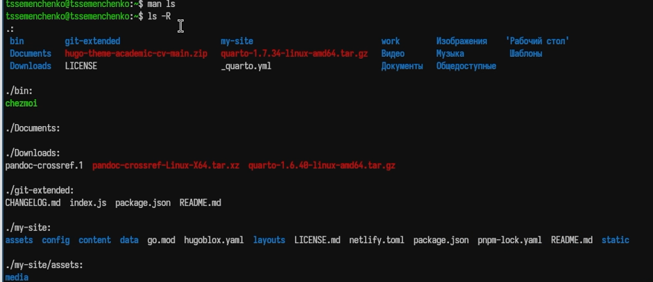
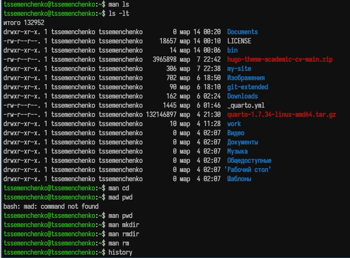

---
## Author
author:
  name: Семенченко Татьяна Сергеевна
  email: 1032253509@rudn.ru
  affiliation:
    - name: Российский университет дружбы народов
      country: Российская Федерация
      postal-code: 117198
      city: Москва
      address: ул. Миклухо-Маклая, д. 6

## Title
title: "Отчет по лабораторной работе №6"
subtitle: "Архитектура компьюера и операционные системы"
license: "CC BY"
---

# Цель работы

Преобретение практичских навыков взаимодействия пользователя с системой посредством командной строки. 

# Задание

Выполнить ряд действий с командами cd, ls, mkdir, rm, history, man для освоения работы в командной строке Unix.

# Выполнение лабораторной работы

## Определение полного имени домашнего каталога

С помощью команды pwd определила полное имя моего домашнего каталога. Перешла в каталог /tmp, использую команду ls с различными функциями ([рис. @fig-01]).

{#fig-01}

{#fig-02}

{#fig-03}

Проверила наличие подкаталога cron в /var/spool. Перешла в домашний каталог и просмотрела его содержимое ([рис. @fig-04]).

{#fig-04}

Создала каталог newdir, а в нем - morefun. Одной командой создала три каталога и одной командой их удалила. Попвталась удалить каталог newdir командой rm без опции - попытка не удалась, поэтому удалила каталог с опцией -r, вместе сс каталогом был удален и подкаталог morefun ([рис. @fig-05]).

{#fig-05}

С помощью команды man изучены опции ls для просмотра подкаталогов (-R) ([рис. @fig-06]).

{#fig-06}

Использовала команду man для просмотра описания следующих команд cd, pwd, mkdir, rmdir, rm ([рис. @fig-07]).

{#fig-07}

С помощью history просмотрела список выполненных команд, выполнила модификацию и исполнение команд из буфера ([рис. @fig-08]).

{#fig-08}

# Выводы

В ходе работы приобретены практические навыки взаимодействия с системой Unix через командную строку, освоены основные команды для навигации, создания и удаления файлов и катлогов, работы с историей и получения справки.

# Контрольные вопросы

1. Командная строка — интерфейс для взаимодействия пользователя с системой путём ввода текстовых команд.
 
2. Абсолютный путь текущего каталога можно определить командой pwd. Пример: /home/username.
 
3. Для определения только типа файлов и их имён используется ls -F. Пример: ls -F показывает / для каталогов, * для исполняемых.
 
4. Информация о скрытых файлах отображается с помощью ls -a. Пример: ls -a показывает . и .. и все файлы, начинающиеся с точки.
 
5. Файл удаляется командой rm, каталог — rm -r или rmdir (для пустых). Пример: rm file.txt, rm -r dir, rmdir emptydir.
 
6. Информация о последних выполненных командах выводится командой history.
 
7. Для модифицированного выполнения используется !<номер>:s/что/начто. Пример: !3:s/a/F выполнит команду 3, заменив a на F.
 
8. Запуск нескольких команд в одной строке: команда1; команда2; команда3. Пример: cd /tmp; ls -l; pwd.
 
9. Экранирование — способ отмены специального значения символов с помощью \. Пример: echo \$HOME выведет $HOME, а не значение переменной.
 
10. ls -l выводит: тип файла, права доступа, число ссылок, владельца, группу, размер, дату, имя.
 
11. Относительный путь указывается относительно текущего каталога. Пример: cd .. (относительный), cd /home/username (абсолютный).
 
12. Информацию о команде можно получить через man команда или команда --help.
 
13. Автоматическое дополнение команд — клавиша Tab.

