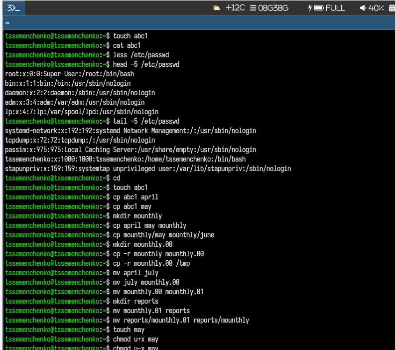
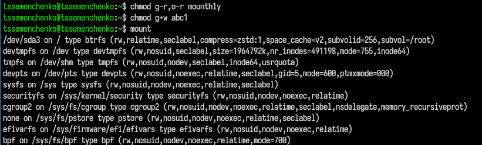
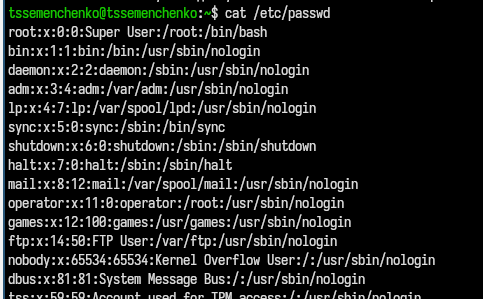
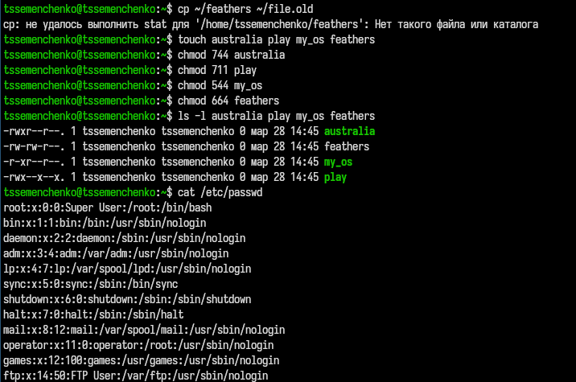
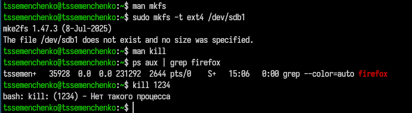

---
## Author
author:
  name: Семенченко Татьяна Сергеевна
  email: 1032253509@rudn.ru
  affiliation:
    - name: Российский университет дружбы народов
      country: Российская Федерация
      postal-code: 117198
      city: Москва
      address: ул. Миклухо-Маклая, д. 6
## Title
title: Анализ файловой системы Linux. Команды для работы с файлами и каталогами.
subtitle: Презентация по лобораторной работе №7
license: CC BY
date: today
date-format: "YYYY-MM-DD" 
---

# Информация

## Докладчик

:::::::::::::: {.columns align=center}
::: {.column width="70%"}

  * Семенченко Татьяна Сергеевна
  * студент, НКАбд-05-25, 1032253509
  * факультет физико-математических и естественных наук
  * Российский университет дружбы народов им. П. Лумумбы

:::
::: {.column width="30%"}

:::
::::::::::::::

# Цель работы

Ознакомление с файловой системой Linux, её структурой, именами и содержанием каталогов. Приобретение практических навыков по применению команд для работы с файлами и каталогами, по управлению процессами, по проверке использования диска и обслуживанию файловой системы.

# Задание

Выполнить действия с командами для работы с файлами и каталогами, изучить права доступа и их изменение, проанализировать файловую систему.

# Выполнение лабораторной работы

## Выполнение первой части

{#fig-01}

## Выполнение первой части 1
 
{#fig-02}

## Выполнение первой части 2

{#fig-03}

## Выполнение второй части лабораторной работы

{#fig-04}

## Содержимое файла

{#fig-05}

## Выполнение второй части лабораторной работы

{#fig-06}

## Выполнение второй части лабораторной работы

{#fig-07}

## Выполнение второй части лабораторной работы

{#fig-08}

## man по следующим командам: mount, fsck, mkfs, kill и примеры 

{#fig-09}

# Выводы 

В ходе работы освоены основные команды для работы с файлами и каталогами в Linux, изучены права доступа и способы их изменения, получены навыки анализа файловой системы.

