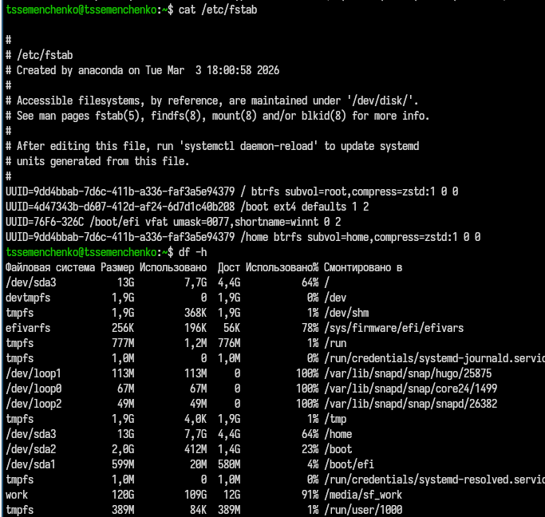
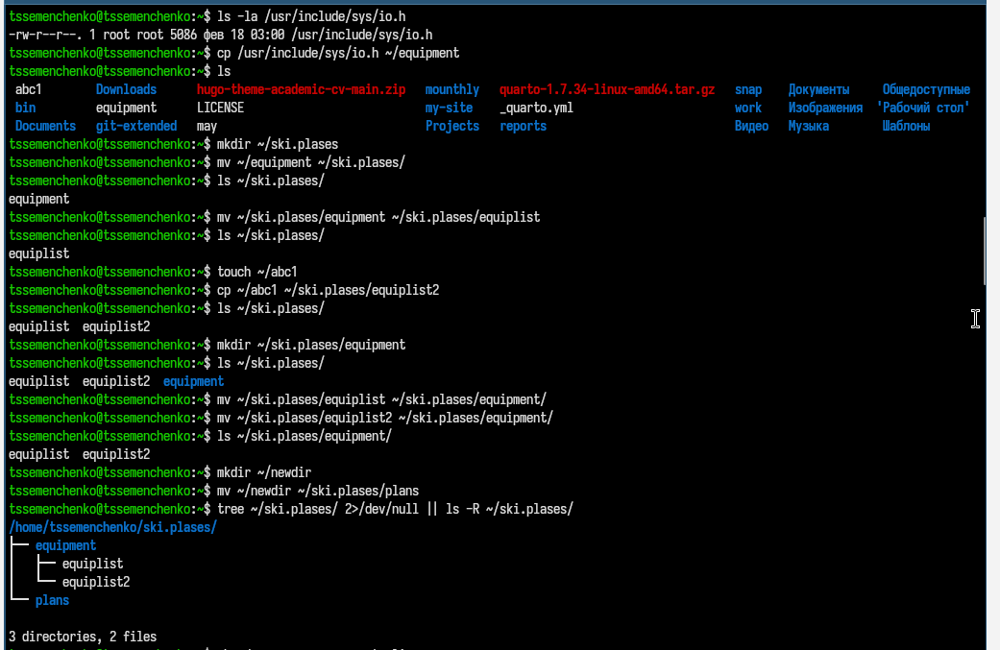
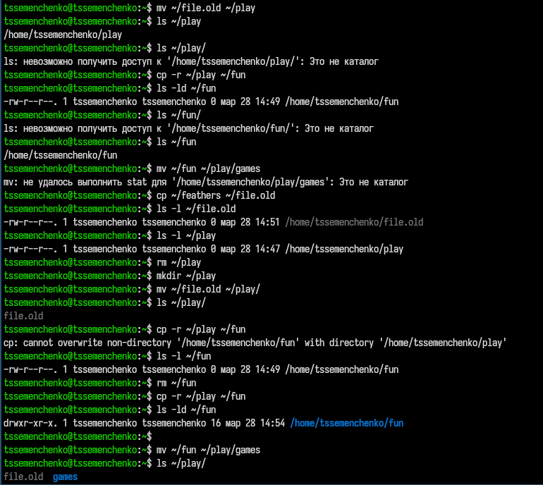
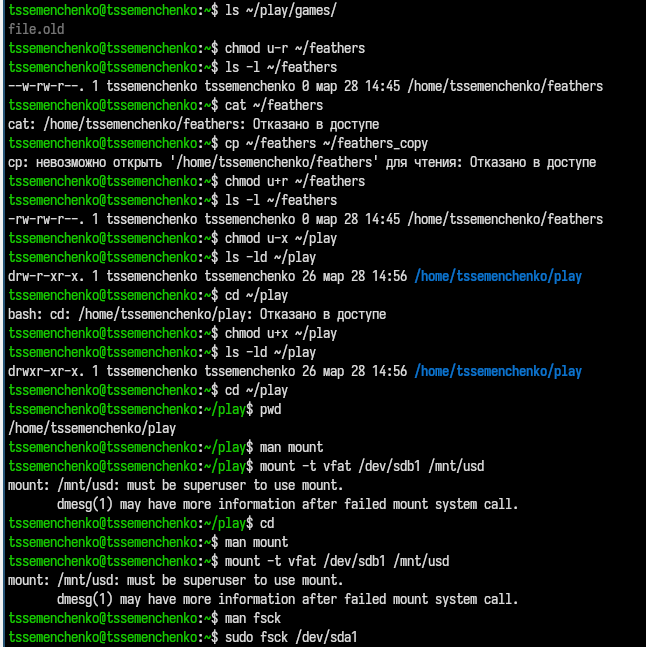

---
## Author
author:
  name: Семенченко Татьяна Сергеевна
  email: 1032253509@rudn.ru
  affiliation:
    - name: Российский университет дружбы народов
      country: Российская Федерация
      postal-code: 117198
      city: Москва
      address: ул. Миклухо-Маклая, д. 6

## Title
title: "Отчет по лабораторной работе №7"
subtitle: "Архитектура компьютера. Операционные системы"
license: "CC BY"
---

# Цель работы

Ознакомление с файловой системой Linux, её структурой, именами и содержанием каталогов. Приобретение практических навыков по применению команд для работы с файлами и каталогами, по управлению процессами, по проверке использования диска и обслуживанию файловой системы.

# Задание

Выполнить действия с командами для работы с файлами и каталогами, изучить права доступа и их изменение, проанализировать файловую систему.

# Выполнение лабораторной работы

## 1. Выполнение примеров из первой части 

Выполняю все команды из первой части лабораторной работы ([рис. @fig-01]).

{#fig-01}
 
{#fig-02}

{#fig-03}

## 2. Выполнение второй части лабораторной работы

Копирую файл в домашний каталог и называю его equipment, создаю директорию, перемещаю файл в каталог, переименовываю файл, создаю файл abc1 и скопировала его в каталог, создала каталог с именем equipment в каталоге ~/ski.plases. , переместила файлы в нужный каталог ([рис. @fig-04]).

{#fig-04}

Посмотрела содержимое файла ([рис. @fig-05]).

{#fig-05}

Скопировала файл, переместила файл. Если посмотреть файл ~/feathers командой cat, то консоль покажет, что "отказано в доступе", если копировать этот файл, консоль выведет аналогичный ответ. ([рис. @fig-06]).

{#fig-06}

{#fig-07}

{#fig-08}

Прочитала man по следующим командам: mount, fsck, mkfs, kill и привела примеры ([рис. @fig-09]).

{#fig-09}

# Выводы 

В ходе работы освоены основные команды для работы с файлами и каталогами в Linux, изучены права доступа и способы их изменения, получены навыки анализа файловой системы.

# Контрольные вопросы
 
1. Команды для просмотра файлов: cat (вывод всего файла), less (постраничный просмотр), head (первые строки), tail (последние строки).
 
2. Команда cp используется с опцией -r для рекурсивного копирования каталогов. Пример: cp -r dir1 dir2.
 
3. Команды mv и mvdir предназначены для перемещения и переименования файлов и каталогов.
 
4. Права доступа определяют, кто и что может делать с файлом или каталогом: чтение (r), запись (w), выполнение (x) для владельца, группы и остальных.
 
5. Для изменения прав доступа используется команда chmod с символьной (u+x) или числовой (755) записью.
 
6. Просмотр смонтированных файловых систем: mount (без параметров) или cat /etc/fstab.
 
7. Для проверки использования диска используется команда df.
 
8. Команда mv позволяет перемещать и переименовывать файлы и каталоги. Пример: mv oldname newname, mv file dir/.
 
9. Права доступа — это набор разрешений для владельца, группы и остальных. Изменяются командой chmod.

