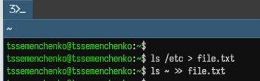
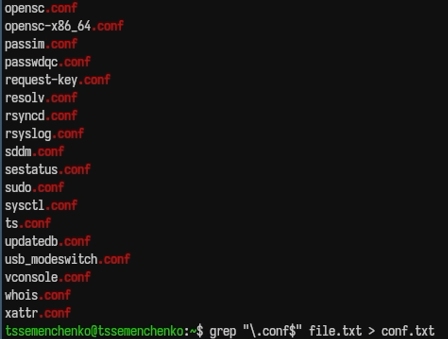
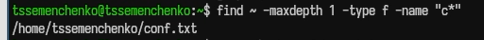
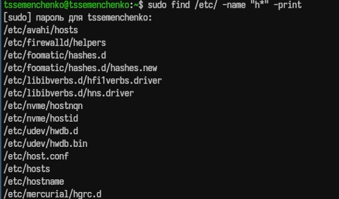
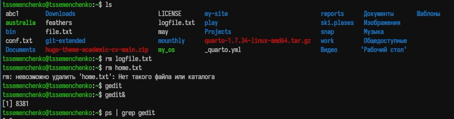
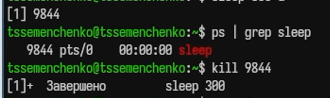
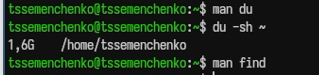

---
## Author
author:
  name: Семенченко Татьяна Сергеевна
  email: 1032253509@rudn.ru
  affiliation:
    - name: Российский университет дружбы народов
      country: Российская Федерация
      postal-code: 117198
      city: Москва
      address: ул. Миклухо-Маклая, д. 6
## Title
title: Поиск файлов и фильтрация данных
subtitle: Презентация по лабораторной работе №8
license: CC BY
date: today
date-format: "YYYY-MM-DD" # Example: 2025-09-06
---

# Информация

## Докладчик

:::::::::::::: {.columns align=center}
::: {.column width="70%"}

  * Семенченко Татьяна Сергеевна
  * студент, НКАбд-05-25, 1032253509
  * факультет физико-математических и естественных наук
  * Российский университет дружбы народов им. П. Лумумбы

:::
::: {.column width="30%"}

:::
::::::::::::::

# Цель работы

Ознакомление с инструментами поиска файлов и фильтрации текстовых данных. Преобретение практических навыков: по управлению процессами (и заданиями), по проверке использования диска и обслуживания текстовых систем.

# Задание

Выполнить действия по перенаправлению ввода-вывода, поиску файлов, фильтрации текста, управлению процессами и проверке использования диска.

# Выполнение лабораторной работы

## 1. Вход в систему
 
{#fig-01}
 
## 2. Запись названий файлов в file.txt
 
{#fig-02}
 
## 3. Поиск файлов с расширением .conf
 
{#fig-03}
 
## 4. Поиск файлов, начинающихся с символа с

{#fig-04}
 
## 5. Поиск файлов в каталоге /etc, начинающихся с h

{#fig-05}
 
## 6-7. Запуск фонового процесса и удаление файла

{#fig-06}
 
## 8-10. Работа с редактором gedit

{#fig-07}
 
## 11. Команды df и du

{#fig-08}
 
## 12. Поиск всех директорий в домашнем каталоге

{#fig-09}

# Выводы

В ходе работы освоены инструменты поиска файлов и фильтрации текстовых данных, приобретены навыки управления процессами, проверки использования диска и обслуживания файловых систем.

