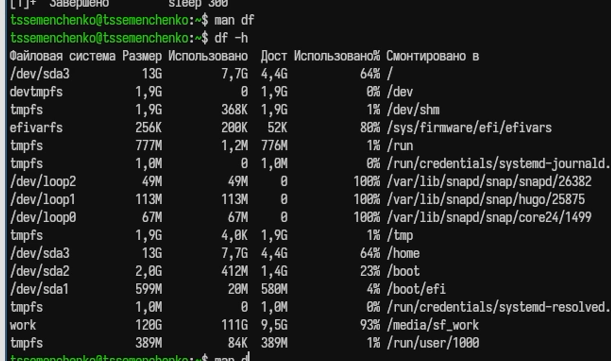

---
## Author
author:
  name: Семенченко Татьяна Сергеевна
  email: 1032253509@rudn.ru
  affiliation:
    - name: Российский университет дружбы народов
      country: Российская Федерация
      postal-code: 117198
      city: Москва
      address: ул. Миклухо-Маклая, д. 6

## Title
title: "Отчёт по лабораторной работе №8"
subtitle: "Архитектура компьютера и операционные системы"
license: "CC BY"
---

# Цель работы

Ознакомление с инструментами поиска файлов и фильтрации текстовых данных. Преобретение практических навыков: по управлению процессами (и заданиями), по проверке использования диска и обслуживания текстовых систем.

# Задание

Выполнить действия по перенаправлению ввода-вывода, поиску файлов, фильтрации текста, управлению процессами и проверке использования диска.
 
# Выполнение лабораторной работы
 
## 1. Вход в систему
 
Осуществлён вход в систему под учётной записью пользователя ([рис. @fig-01]).
 
{#fig-01}
 
## 2. Запись названий файлов в file.txt
 
Выполнена запись названий файлов из каталога /etc в файл file.txt. Затем в этот же файл дописаны названия файлов из домашнего каталога ([рис. @fig-02]).
 
{#fig-02}
 
## 3. Поиск файлов с расширением .conf
 
Из файла file.txt выделены все файлы с расширением .conf и записаны в новый файл conf.txt ([рис. @fig-03]).
 
{#fig-03}
 
## 4. Поиск файлов, начинающихся с символа с
 
В домашнем каталоге найдены файлы, имена которых начинаются с символа с. Использованы различные варианты команды find ([рис. @fig-04]).
 
{#fig-04}
 
## 5. Поиск файлов в каталоге /etc, начинающихся с h
 
Выведены на экран имена файлов из каталога /etc, начинающиеся с символа h ([рис. @fig-05]).
 
{#fig-05}
 
## 6-7. Запуск фонового процесса и удаление файла
 
Запущен в фоновом режиме процесс, записывающий в файл ~/logfile файлы с именами, начинающимися на log. Затем файл ~/logfile удалён ([рис. @fig-06]).
 
{#fig-06}
 
## 8-10. Работа с редактором gedit
 
Запущен в фоновом режиме редактор gedit. С помощью команд ps и grep определён идентификатор процесса gedit. Изучена команда kill, с её помощью завершён процесс gedit ([рис. @fig-07]).
 
{#fig-07}
 
## 11. Команды df и du
 
Изучена справочная информация о командах df и du с помощью man. Выполнен вывод информации об использовании диска ([рис. @fig-08]).
 
{#fig-08}
 
## 12. Поиск всех директорий в домашнем каталоге
 
С помощью команды find выведены имена всех директорий, имеющихся в домашнем каталоге ([рис. @fig-09]).
 
{#fig-09}
 
# Выводы
 
В ходе работы освоены инструменты поиска файлов и фильтрации текстовых данных, приобретены навыки управления процессами, проверки использования диска и обслуживания файловых систем.
 
# Контрольные вопросы
 
1. В системе есть три стандартных потока: stdin (0) — стандартный ввод, stdout (1) — стандартный вывод, stderr (2) — стандартный вывод ошибок.
 
2. Оператор > перезаписывает файл, а >> добавляет в конец файла.
 
3. Конвейер (pipe) — механизм передачи вывода одной команды на ввод другой команды, обозначается символом |.
 
4. Процесс — это программа в стадии выполнения. Программа — это статический набор инструкций, процесс — динамический объект с состоянием.
 
5. PID (Process ID) — уникальный идентификатор процесса. GID (Group ID) — идентификатор группы процессов.
 
6. Задачи (jobs) — фоновые процессы. Управлять ими можно командой jobs, а также fg, bg, kill.
 
7. top — интерактивная программа для мониторинга процессов. htop — улучшенная версия top с более удобным интерфейсом.

8. Команда find используется для поиска файлов. Примеры: find ~ -name "*.txt" -print, find /etc -type f -name "*.conf".
 
9. Да, для поиска по содержимому используется grep. Пример: grep "текст" *.txt.
 
10. Объем свободной памяти на диске можно определить командой df -h.
 
11. Объем домашнего каталога можно определить командой du -sh ~.
 
12. Зависший процесс удаляется командой kill с PID процесса. Если процесс не завершается, используется kill -9 PID.

