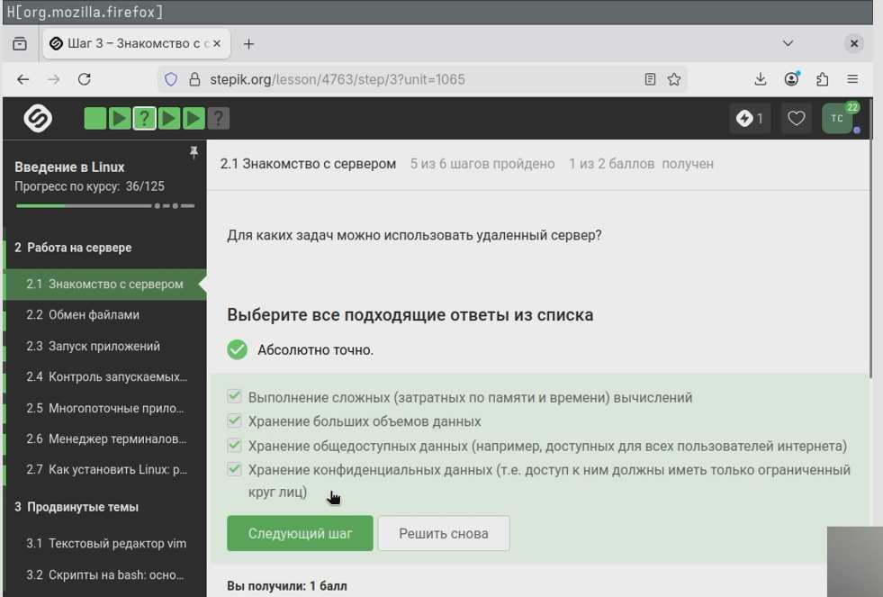
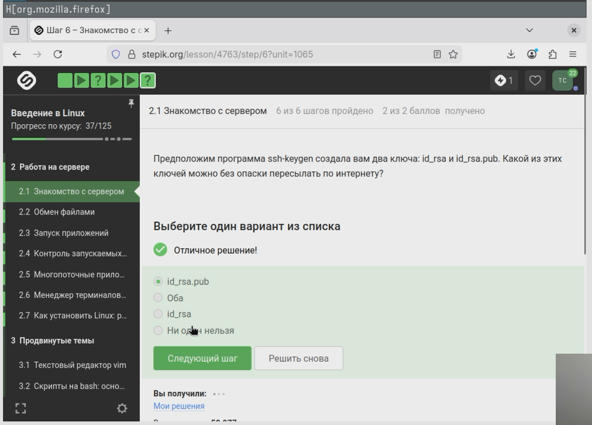
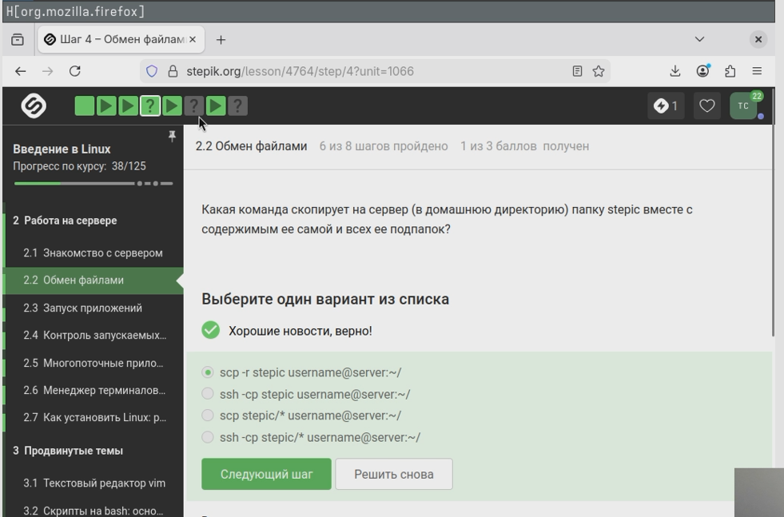
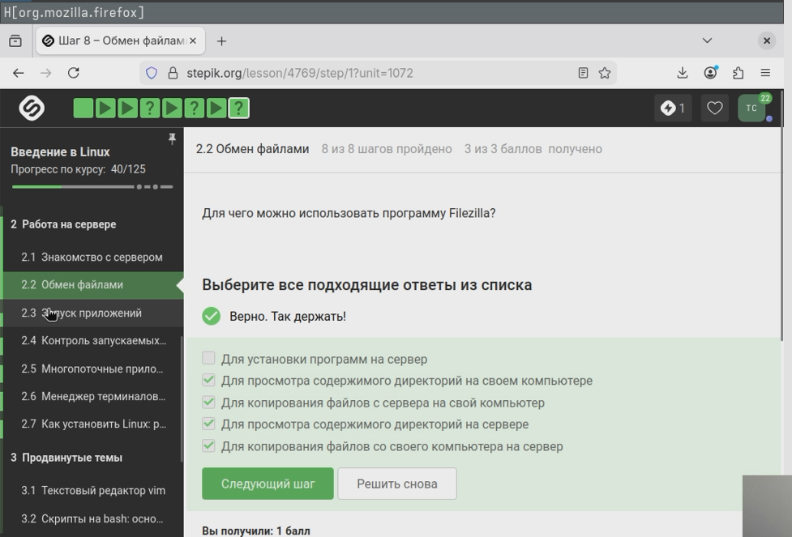
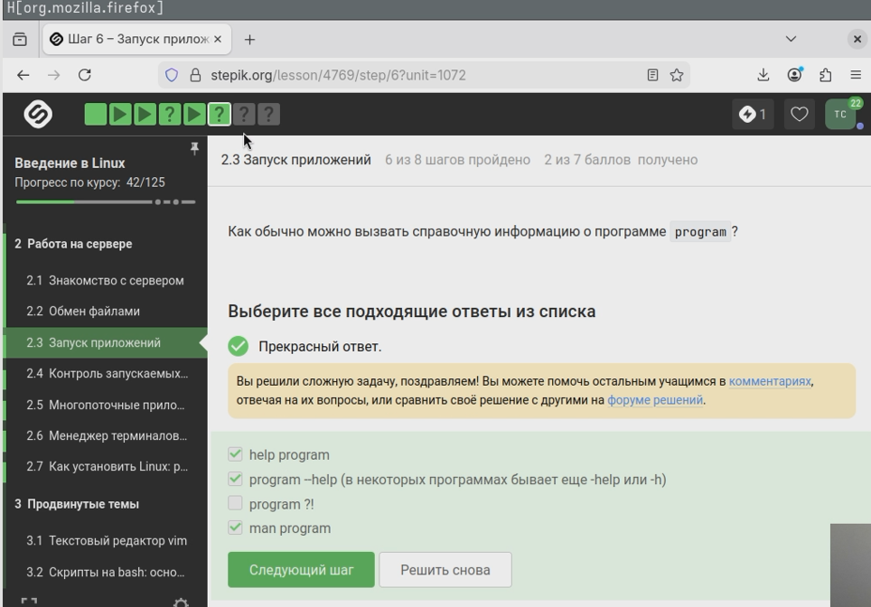
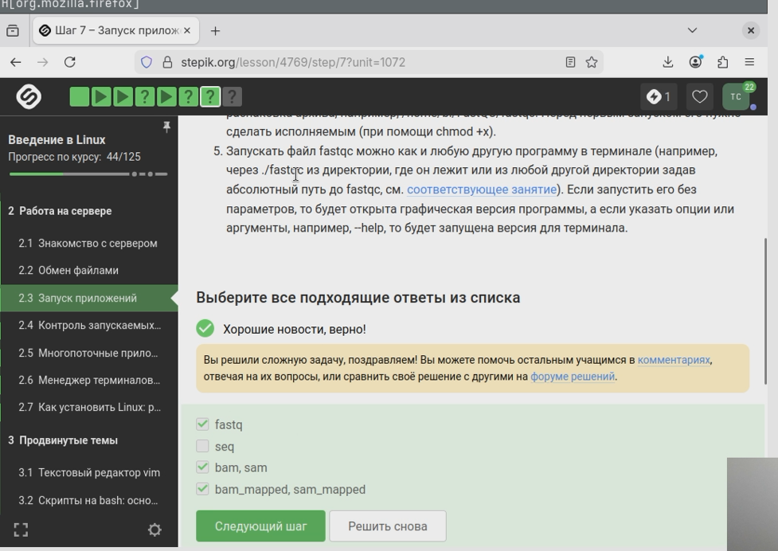
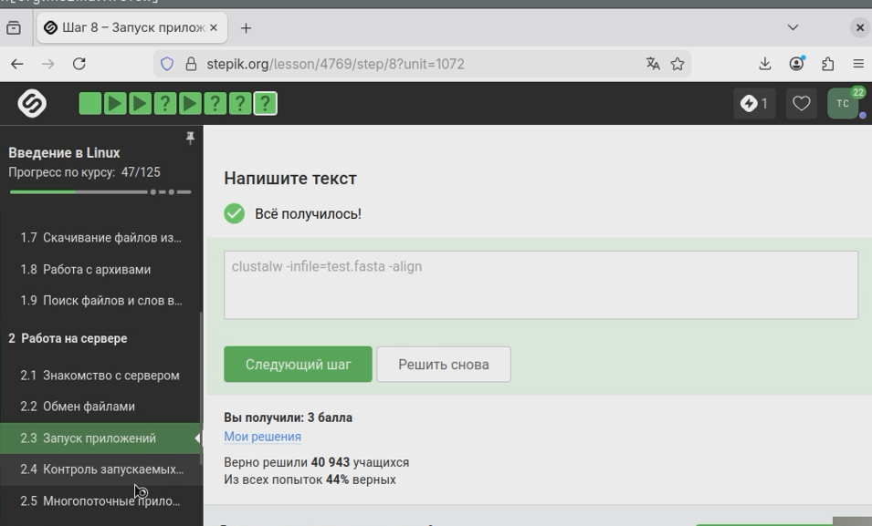

---
## Author
author:
  name: Семенченко Татьяна Сергеевна
  email: 1032253509@rudn.ru
  affiliation:
    - name: Российский университет дружбы народов
      country: Российская Федерация
      postal-code: 117198
      city: Москва
      address: ул. Миклухо-Маклая, д. 6
## Title
title: Внешний курс "Введение в Linux!"
subtitle: Модуль 1
license: CC BY
date: today
date-format: "YYYY-MM-DD" # Example: 2025-09-06
---

# Информация

## Докладчик

:::::::::::::: {.columns align=center}
::: {.column width="70%"}

  * Семенченко Татьяна Сергеевна
  * студент, НКАбд-05-25, 1032253509
  * факультет физико-математических и естественных наук
  * Российский университет дружбы народов им. П. Лумумбы
  
:::
::: {.column width="30%"}

:::
::::::::::::::

# Цель работы

Выполнить второй модуль внешнего курса stepic "Введение в Linux!" 

# Задание

Выполнение и объяснение правильных ответов 

# Выполнение курса

## Знакомство с сервером
 
{#fig-01}

## Знакомство с сервером

{#fig-02}

## Обмен файлами

{#fig-03}

## Обмен файлами

{#fig-04}

## Обмен файлами

{#fig-05}

## Запуск приложений 

{#fig-06}

## Запуск приложений 

{#fig-07}

## Запуск приложений 

{#fig-08}

## Запуск приложений 

{#fig-09}

## Контроль запускаемых программ 

{#fig-10}

## Контроль запускаемых программ

{#fig-11}

## Контроль запускаемых программ

{#fig-12}

## Контроль запускаемых программ

{#fig-13} 

## Многопоточные приложения 

{#fig-14}

## Многопоточные приложения 

{#fig-15}

## Многопоточные приложения 

{#fig-16}

## Многопоточные приложения 

{#fig-17}

## Многопоточные приложения 

{#fig-18}

## Менеджер терминалов tmux

{#fig-19}

## Менеджер терминалов tmux

{#fig-20}

## Менеджер терминалов tmux

{#fig-21}

## Менеджер терминалов tmux

{#fig-22}

## Менеджер терминалов tmux

{#fig-23}

## Менеджер терминалов tmux

{#fig-24}

# Выводы

Пройден второй модуль курса "Введение в Linux!"
