---
## Author
author:
  name: Семенченко Татьяна Сергеевна
  email: 1032253509@rudn.ru
  affiliation:
    - name: Российский университет дружбы народов
      country: Российская Федерация
      postal-code: 117198
      city: Москва
      address: ул. Миклухо-Маклая, д. 6

## Title
title: "Отчёт для первого модуля внешнего курса"
subtitle: "Модуль 1"
license: "CC BY"
---

# Цель работы

Пройти внешний курс "Введение в Linux!"

# Задание

Прохождение 1 модуля внешнего курса на stepic "Введение в Linux!".

# Выполнение курса

## Общая информация о курсе

Курс называется "Введение в Linux!"([рис. @fig-01]).

{#fig-01}

Правильные ответы в вопросе прохождения курса ([рис. @fig-02]).

{#fig-02}

## Как установить Linux

Я использую windows операционную систему ([рис. @fig-03]).

{#fig-03}

Виртуальная машина - это специальная программа для запуска одной ОС на другой ОС ([рис. @fig-04])

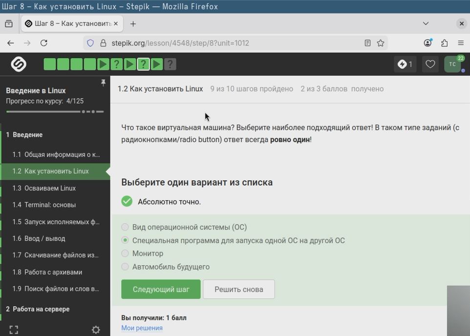{#fig-04}

Да, я работаю с системе Linux ([рис. @fig-05]).

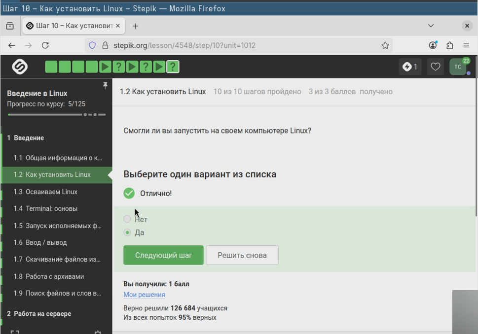{#fig-05}

## Осваиваем Linux

Создала документ LibreOffice Writer и написала шрифтом FreeMono Hello, Linux! ([рис. @fig-32]).

{#fig-32}

Ubuntu имеет расширение deb ([рис. @fig-06]).

{#fig-06}

Установила VLC и написала фамилию "Denis-Courmont" ([рис. @fig-07]).

{#fig-07}

Update Manager можно использовать для обновления ссылок в Software Center, установленных программ, всей системы до новой версии ([рис. @fig-08]).

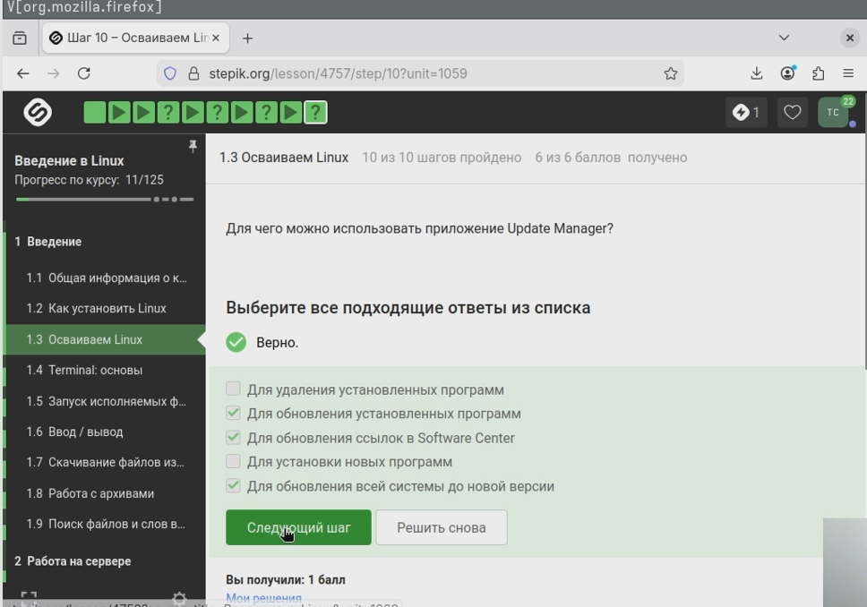{#fig-08}

## Terminal: основы

Синонимами являются Терминал и Консоль ([рис. @fig-09]).

{#fig-09}

Команда pwd ([рис. @fig-10]).

{#fig-10}

Указала верные команды ([рис. @fig-11]).

{#fig-11}

Указала верные команды ([рис. @fig-12]).

{#fig-12}

Команда rm -r ([рис. @fig-13]).

{#fig-13}

## Запуск исполняемых файлов

После команды Exit ничего не закроется ([рис. @fig-14]).

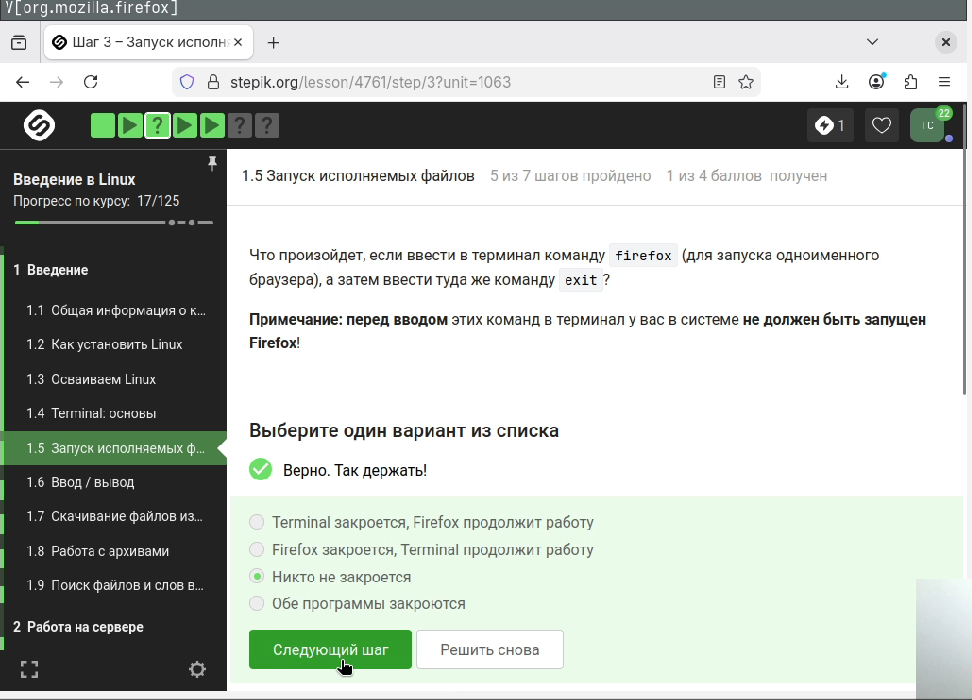{#fig-14}

Запуск, Ctrl+Z, bg ([рис. @fig-15]).

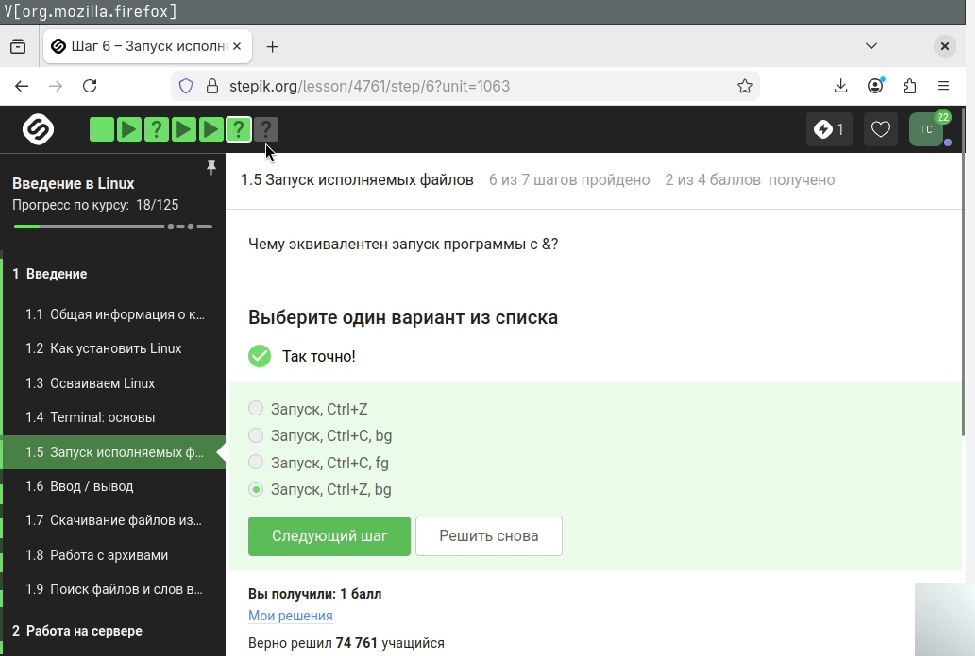{#fig-15}

Исполнила файл через python3, скопировала его вывод ([рис. @fig-16]).

{#fig-16}

{#fig-17}

## Ввод / вывод

Поток ошибок выводится на экран ([рис. @fig-18]).

{#fig-18}

Выбрала команды с >, >> ([рис. @fig-20]).

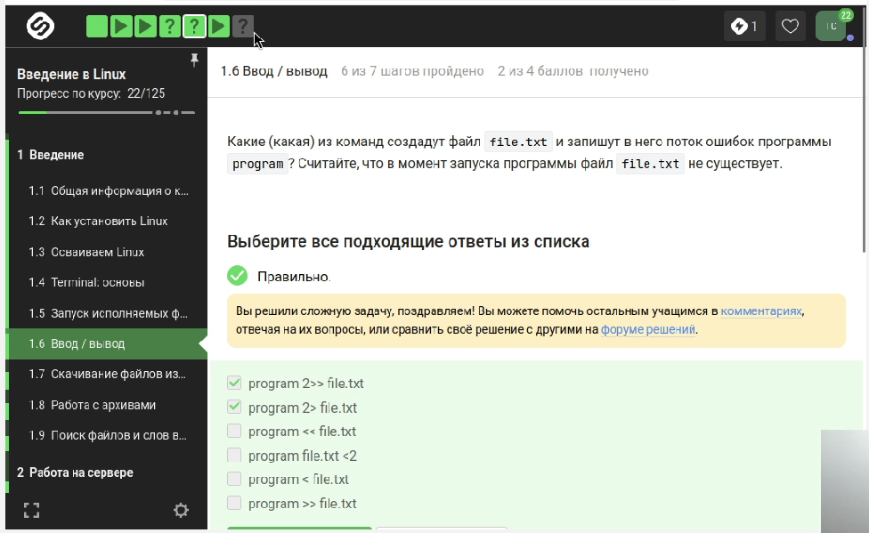{#fig-20}

Сообщения об ошибках выводятся на экран ([рис. @fig-21]).

{#fig-21}

## Скачивание файлов из интернета

Картинка окажется в /home/alex/1.jpg ([рис. @fig-22]).

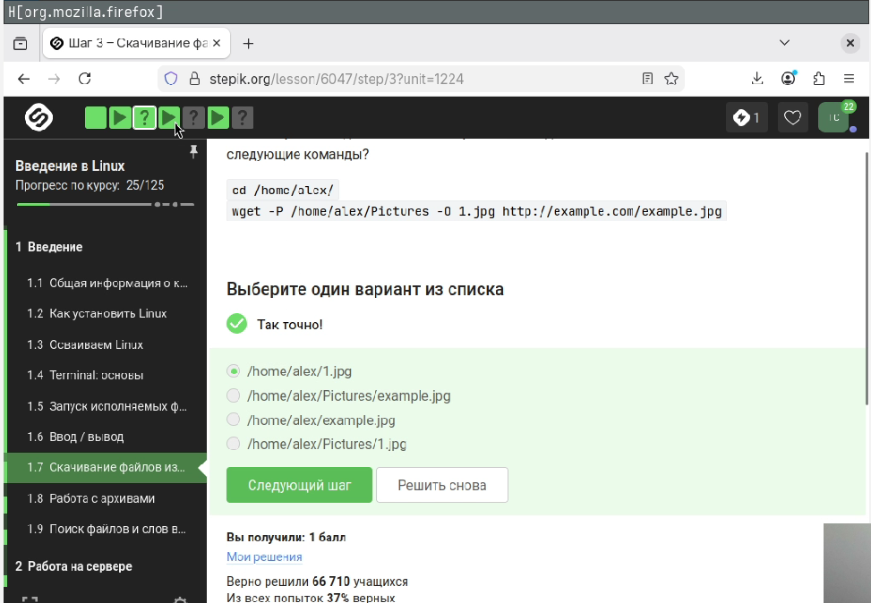{#fig-22}

Опцию -q или --quiet ([рис. @fig-23]).

{#fig-23}

Выбрала ответ: Будут скачаны jpg и html файлы, но все html будут удалены ([рис. @fig-24]).

{#fig-24}

## Работа с архивами 

gzip удаляет архив после его распаковки ([рис. @fig-25]).

{#fig-25}

zip и tar ([рис. @fig-26]).

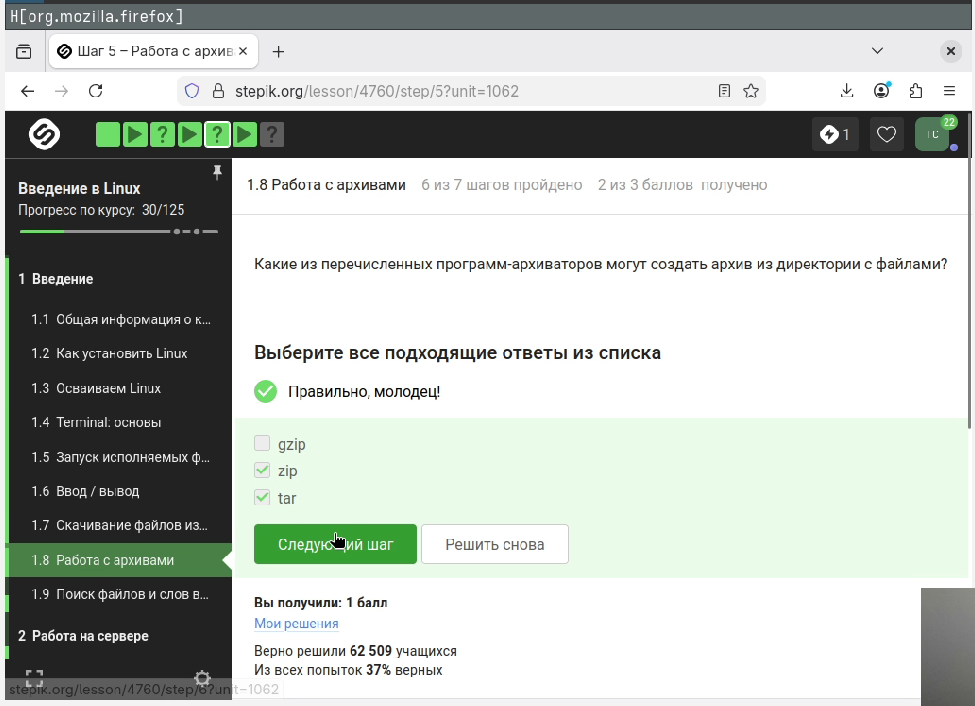{#fig-26}

Нужно указать -cjf ([рис. @fig-27]).

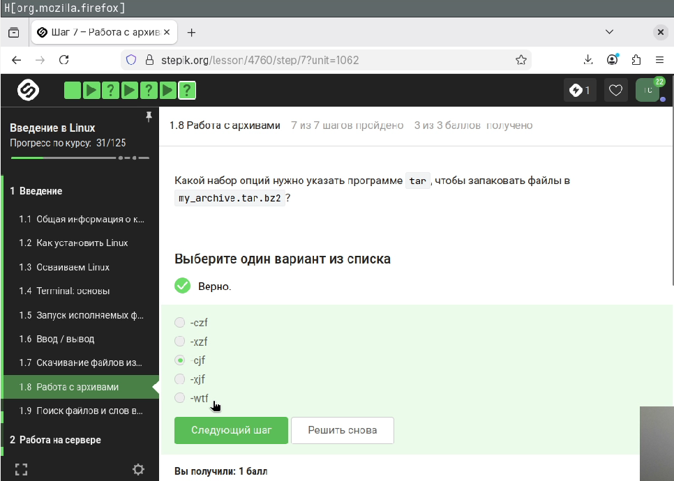{#fig-27}

## Поиск файлов и слов в файлах

Команды *.jpg, alexey.*, *.? НЕ найдут файл Alexey.jpeg ([рис. @fig-28]).

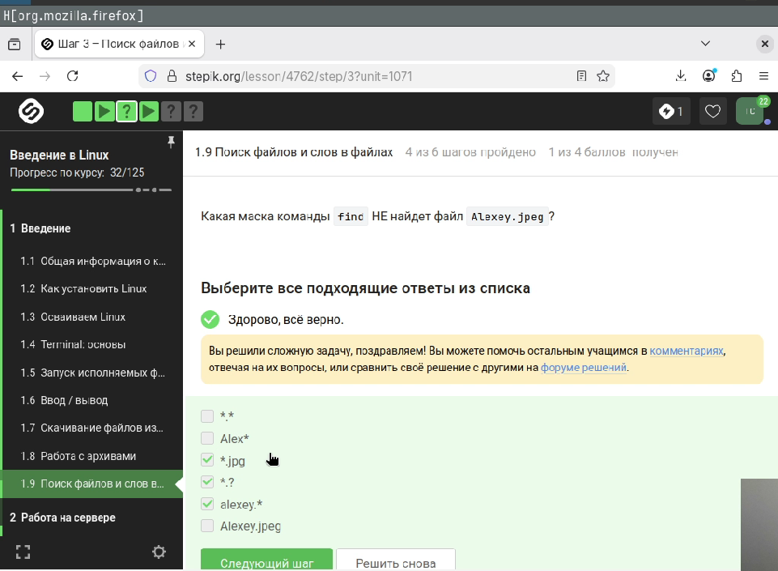{#fig-28}

Выбираем там, где есть world учитывая регистр, должно быть с маленькой буквы ([рис. @fig-29]).

{#fig-29}

Скачала архив, сгенерировала и загрузила файл в форму ([рис. @fig-30]).

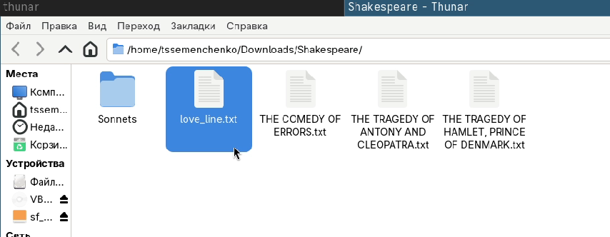{#fig-30}

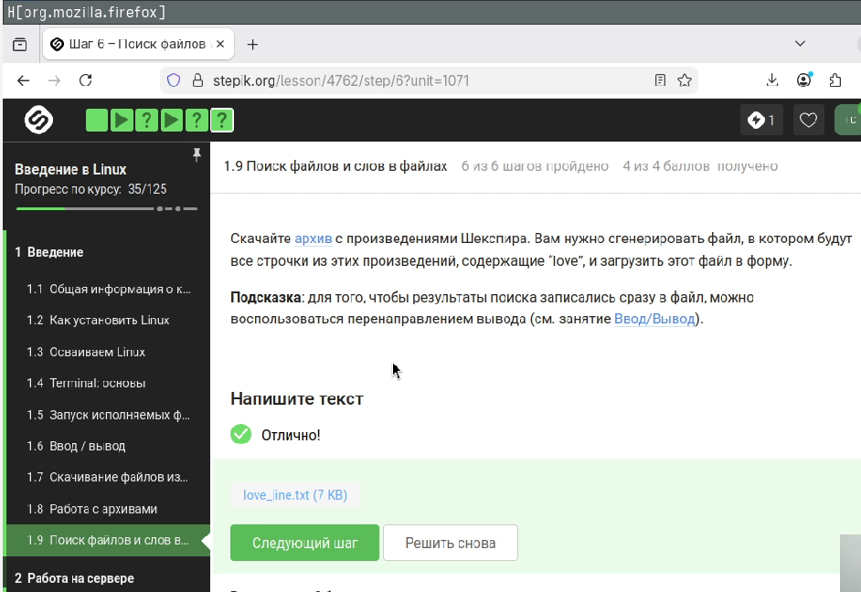{#fig-31}

# Выводы

Прошёла Модуль 1 курса stepik "Введение в Linux!"
