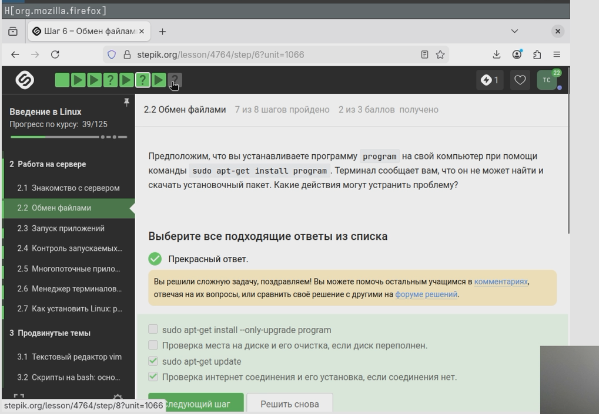
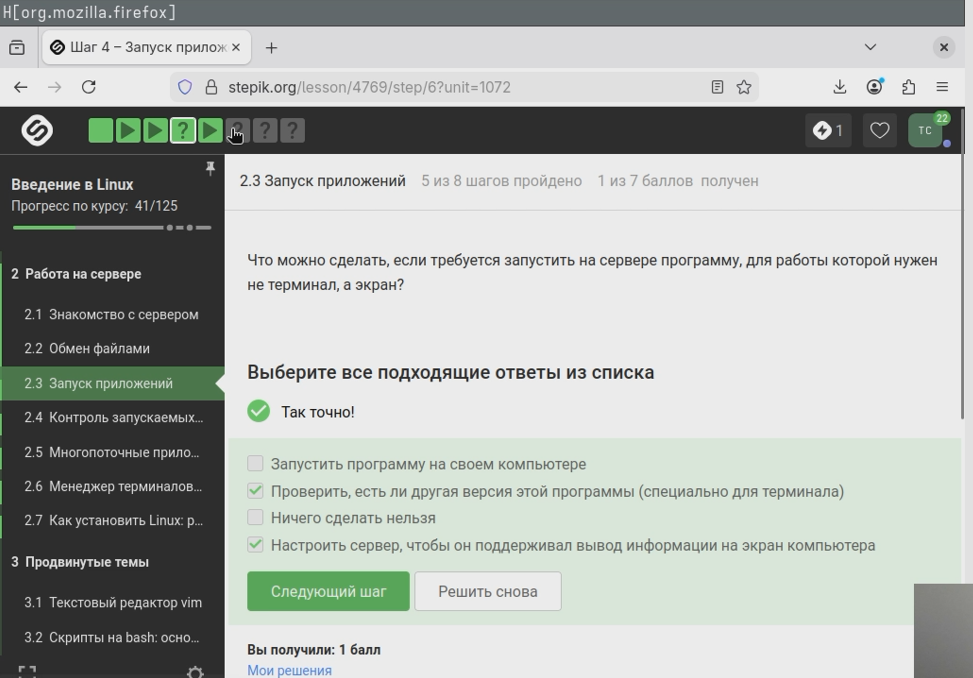
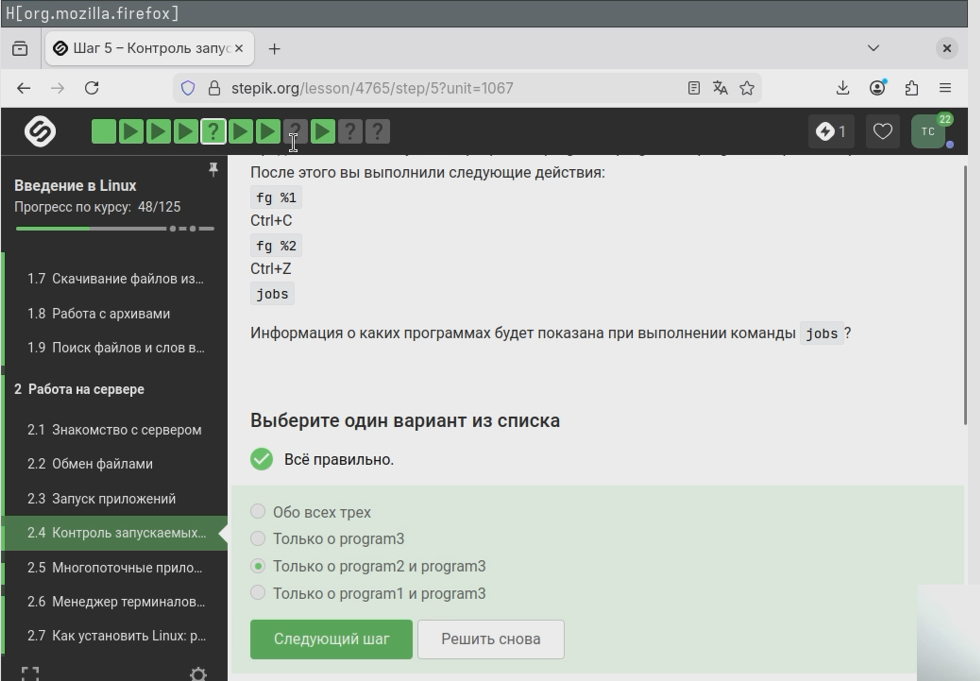
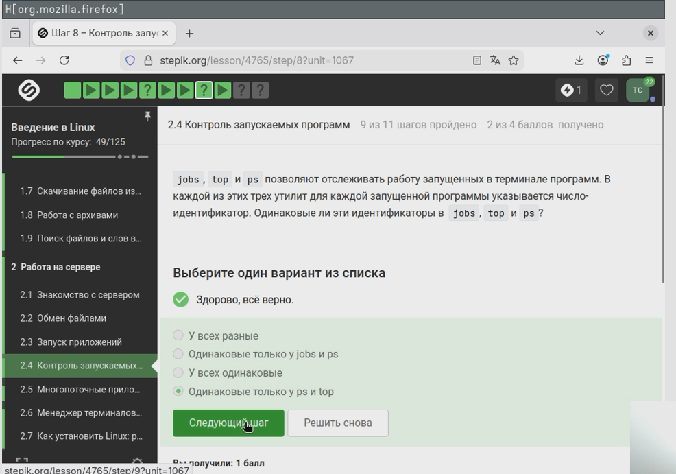
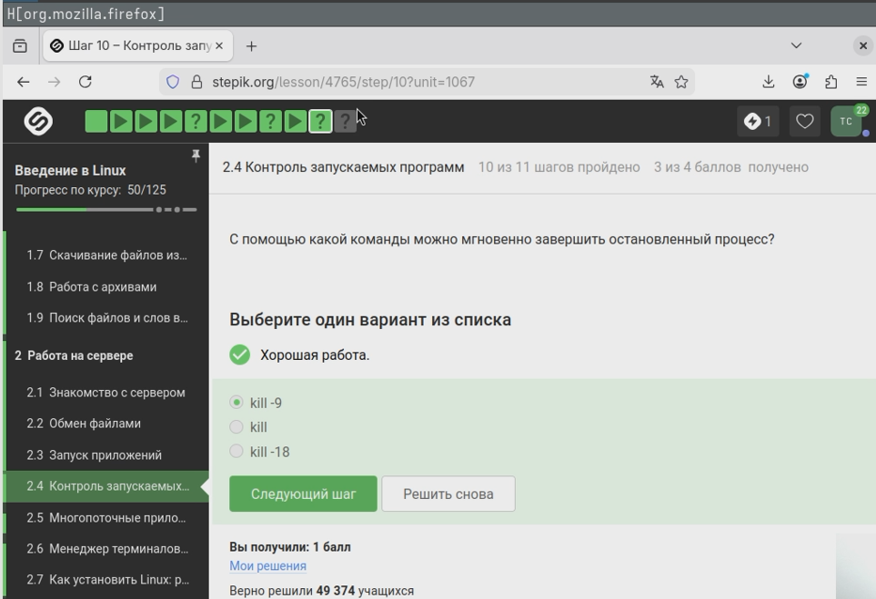

---
## Author
author:
  name: Семенченко Татьяна Сергеевна
  email: 1032253509@rudn.ru
  affiliation:
    - name: Российский университет дружбы народов
      country: Российская Федерация
      postal-code: 117198
      city: Москва
      address: ул. Миклухо-Маклая, д. 6

## Title
title: "Отчёт по второму этапу внешнего курса"
subtitle: "Модуль 2"
license: "CC BY"
---

# Цель работы

Выполнить второй модуль внешнего курса stepic "Введение в Linux!" 

# Задание

Выполнение и объяснение правильных ответов 

# Выполнение курса

## Знакомство с сервером

Выполнение сложных вычислений - на удаленном сервере больше ресурсов, чем на обычном ПК, и он может работать длительное время без перерыва. 
Хранение конфиденциалиных данных - сервер позволяет настроить строгие права доступа, шифрование и логирование, чтобы данные видели только авторизованные пользователи. 
Хранение больших объемов данных - сервер легко масштабировать по мессту на диске, это экономичнее, чем на свем устройстве. 
Хранение общедоступных данных - сервер можно напрямую подключить к интернету и открыть доступ всем желающим. Поэтому все варианты ответов верные. ([рис. @fig-01])
 
{#fig-01}

id_rsa.pub - это верный ответ, т.к ключт открытый, публичный. Его можно передавать по интернету, например, для размещения на удаленых файлах. А вот закрытый ключ id_rsa нельзя передавать никому. ([рис. @fig-02])

{#fig-02}

## Обмен файлами

scp -r stepic username@server: ~/ - верный ответ.
scp - команда для копирования через SSH.
-r - опция для копирования папок вместе со всем содержимым и подпапками.
stepik - имя папки.
username@server: ~/ - целевой сервер и домашняя директория.
Остальные варианты команд не подходят.
scp stepic/* username@server: ~/ - спокирует только файлы папки, но не саму папку и подпапки.
ssh -cp stepic username@server: ~/ - ssh не предназначен для копирования, а опция -cp не имеет смысла.
ssh -cp stepic/* username@server: ~/ - то же самое. ([рис. @fig-03])

{#fig-03}

sudo apt-get update - обновляет список доступных пакетов из репозиториев. 
sudo updrade - обновляет уже установленные пакеты, но не исправляет отсутствие информации о новом пакете и не добавляет новые программы.
sudo apt-get install --only-upgrade program - пфтается обновить программу, только если она уже установлена. ([рис. @fig-04]) 

{#fig-04}

Для запуска программ на сервере - Filezilla не выполняет команды и не запускает процессы на сервере.
Для копирования файлов с сервера на свой компьютер, Для копирования файлов со своего компьютера на сервер, Для просмотра содержимого директорий на сервере - верно.
Для установки программ на сервер - установка требует доступ к SSH и пакетному менеджеру, Filezilla это не делает. ([рис. @fig-05])

{#fig-05}

## Запуск приложений 

Настроить сервер, чтобы он поддерживал вывод информации на экран компьютера - это возможно, например, с помощью RDP.
Запустить программу на своем компьютере - это не решит проблему запуска именно на сервере.
Проверить, есть ли другая версия этой программы (специально для терминала) - многие графические программы имеют консольные аналоги, так что вариант.
Ничего сделать нельзя - варианты решений проблемы есть, так что ответ неверный. ([рис. @fig-06])

{#fig-06}

help program - работает для встроенных команд(help cd и тд), но не для внешних.
program --help (в некоторых программах бывает еще -help или -h) - стандартный короткий вывод справки для большинства программ.
man program - полное руководство.
program ?! - некорректная команда, её не существует. ([рис. @fig-07])

{#fig-07}

bam, sam - бинарный и текстовый форматы выравнивания, подходит.
fastqc - название самой программы.
fastq - самый распространённый формат.
bam_mapped, sam_mapped - только выровненные последовательности из BAM и SAM файлов. ([рис. @fig-08])

{#fig-08}

clustalw - вызов программы
-align - опция, которая явно указывает, что нужно выполнить множественное выравнивание.
-infile=test.fasta - задаёт входной файл с последовательностями. ([рис. @fig-09])

{#fig-09}

## Контроль запускаемых программ 

fg %1 - фоновая программа program1 переводи тся на передний план.
Ctrl+С - отправляет сигнал, завершая program1 и та удаляется из списка jobs.
fg %2 - программа program2 переводится на передний план и выполняется на переднем плане.
Ctrl+Z - приостанавливает program2, которая останавливается, но остаётся в списке jobs как остановленная.
jobs - показывает все активные и остановленные задачи -> program2 и program3(фоном). ([рис. #fig-10])

{#fig-10}

Одинаковые только у ps и top - глобальный идентификатор процесса в системе. Они смотрят на одни и те же процессы, поэтому PID совпадают.
jobs - показывает номер задания (ID), является локальным идентификатором. ([рис. @fig-11])

{#fig-11}

kill - отправляет сигнал завершения, который процесс может перехватить, обработать или проигнорировать. Мгновенно не сработает, т.к. процесс не выполняется и не может обработать сигнал.
kill -9 - отправляет сигнал безусловного завершений, который процесс не может проигнорировать или перехватить.
kill -18 - возобновляет выполнение остановленного процесса, а не завершает его. ([рис. @fig-12])

{#fig-12}

kil без опций отправляет запрос процессу на завершение. Однако процесс приостановлен и не обрабатывает сигналы до тех пор, пока не будет возобновлён. Когда процесс продолжит работу, он получит ожидающий сигнал и начнёт своё завершение. ([рис. @fig-13])

{#fig-13} 

## Многопоточные приложения 

0% CPU - верный ответ, т.к. процесс остановлен и не выполняется на процессоре.
Столько, сколько использовалось до остановки - нет, использование CPU падает до нуля мгновенно.
100% CPU - нет, это значение только для активно работающего однопоточного процесса.
В два раза меньше, чем использовалось до остановки - такого нет. ([рис. @fig-14])

{#fig-14}

Столько, сколько оно потребляло в момент остановки - остановка процесса приостанавливает его выполнение, но не освобождает выделенную под него память. Все данные, которые процесс успел загрузить в оперативную память, остаются на месте. ([рис. @fig-15])

{#fig-15}

Никак - верно
Командой kill --thread - такой команды в Linux не существует.
Сочетанием клавиш Ctrl+C - завершает весь процесс, а не отдельный поток.
Командой threadkill - нет такой команды в Linux. ([рис. @fig-16])

{#fig-16}

Только bowtie2 можно выполнять в несколько потоков, а bowtie2-build годится для последовательного выполнения. ([рис. @fig-17])

{#fig-17}

Верно выполнила задание, показала содержимое файла. ([рис. @fig-18])

{#fig-18}

## Менеджер терминалов tmux

Терминал сообщит, что нет процесса для запуска в fg - это верно, потому что fg работает только с заданиями текущей сессии, а каждая вкладка - это отдельный экземпляр.
Процесс переместится во вторую вкладку, но останется в режиме "приостановки", Процесс вернется к работе в исходной вкладке, Процесс переместится во вторую вкладку и продолжит работу - неверно, что следует из верного ответа. ([рис. @fig-19])

{#fig-19}

Когда в tmux закрывается последняя вкладка в сессии, сессия становится пустой. tmux автоматически завершает её, если в ней нет ни одного окна, поэтому когда команда exit закрывает последнее окно, сессия становится пустой и tmux завершает её работу.
tmux продолжит работу без вкладок - неверно, пустая сессия не может существовать.
tmux выдаст предупреждение и не закроет вкладку - предупреждение может появиться, если попытаться закрыть окно с запущенными процессами, но exit обычно выполянется без предупреждений в пустой командной строке. ([рис. @fig-20])

{#fig-20}

Соединение с сервером прервется, но работа tmux продолжится - это верно.tmux запускает сессию, которая существует независимо от подключения к терминалу. Все процессы внутри tmux выполняются на сервере как фоновые.
Когда мы закрываем терминал, клиентская часть tmux отключается, но серверная продолжает работу на сервере со всеми запущенными процессами. Чтобы подключить к той же сессии, достаточно заново войти на сервер по SHH и выполнить tmux attach.
Соединение с сервером прервется, что вызовет завершение работы tmux - нет, tmux специально создан для работы в отключённом режиме.
Соединение с сервером прервется, и tmux и все запущенные в нем процессы приостановятся до момента восстановления соединения - нет, они продолжают выполняться в фоновом режиме.
Соединение с сервером сохранится и продолжится, как только вы снова откроете терминал - нет, закрытие терминала обрывает сетевое соединение SHH. ([рис. @fig-21])

{#fig-21}

Вкладка закроется, а вместе с ней пропадет и запущенный в ней процесс - верно. В tmux при закрытии окна все процессы, запущенные внутри этого кона получат сигнал и завершатся.
tmux выдаст предупреждение и не даст закрыть вкладку - по умолчанию tmux не справшивает подтверждением перед закрытием окна с фоновыми процессами.
Вкладка закроется и процесс перейдет во вкладку, ближайшую из открытых (если есть, то слева, иначе справа) - нет, tmux не имеет такой функциональности. Чтобы процесс выжил при закрытии окна,
его нужно запустить внутри отдельной tmux сессии. ([рис. @fig-22])

{#fig-22}

Ctrl+B и ~ (тильда) - не является стнадартной командой для переименовывания окна в tmux.
Ctrl+B и . (точка) - не является стнадартной командой для переименовывания окна в tmux.
Ctrl+B и r - в стандартной конфигурации tmux эта команда не определена.
Ctrl+B и i - выводит информацию о те6кущем окне.
Ctrl+B и , (запятая) - верный ответ. ([рис. @fig-23])

{#fig-23}

Вкладку можно разделить и горизонтально, и вертикально, и даже по несколько раз -- просто используем нужные команды-"разделения" необходимое количество раз - верно. Можно многократно делить любую панель как угодно.
Если разделенную горизонтально вкладку разделить еще и вертикально (т.е. нажать один раз Ctrl+B и %), то получится 3 "части" -- две маленькие и одна большая - верно. При горизонтальном разделении получаются две маленькие панели.
Затем , если разделить одну из них вертикально, получится 3 панели ( большая, нетрунутая правая или левая панель и 2 маленькие - разделённая на 2 части одна из этих панелей.
Команды-"разделения" действуют только в текущей вкладке tmux, а не во всех вкладках одновременно - верно. Каждая вкладка имеет своё независимое расположение панелей.
Можно закрыть одну из "частей" вкладки выполнив (Ctrl+B и x) - верно. Это закрывает текующую панель, а не всю вкладку. Остальные панели остаются.
По половинкам "разделенной" вкладки можно перемещаться при помощи обычного нажатия на стрелочки (без использования Ctrl+B) - неверно. Для перемещения между панелями нужно использовать Ctrl+B и затем стрелку  Ctrl+B и o.
Вкладку можно разделить только горизонтально или только вертикально, а на попытку ввести вторую команду-"разделения" она реагировать уже не будет - неверно. Можно делить многократно и комбинировать. ([рис. @fig-24])

{#fig-24}

# Выводы

Пройден второй модуль курса "Введение в Linux!"

