---
## Author
author:
  name: Семенченко Татьяна Сергеевна
  email: 1032253509@rudn.ru
  affiliation:
    - name: Российский университет дружбы народов
      country: Российская Федерация
      postal-code: 117198
      city: Москва
      address: ул. Миклухо-Маклая, д. 6

## Title
title: "Отчёт для третьего модуля внешнего курса"
subtitle: "Модуль 3"
license: "CC BY"
---

# Цель работы

Пройти внешний курс "Введение в Linux!"

# Задание

Прохождение 3 модуля внешнего курса на stepic "Введение в Linux!".

# Выполнение курса

## Текстовый редактор vim

" : ", затем "q", затем "Еnter" - в vim мы по умолчанию находимся в нормальном режиме, но чтобы выполнить команду выхода, нужно перейти в командный режим с помощью ":", затем ввести "q" и нажать Enter. Просто q или Q не сработают, так как они либо ничего не делают в нормальном режиме, либо переключают режим. ([рис. @fig-01])

!()[image/3.1.png]{#fig-01}

Суть задания: word — буквы, цифры, _; WORD — любые непробельные символы. Из-за разного состава символов W перемещается быстрее и останавливается только на пробелах ([рис. @fig-02]).

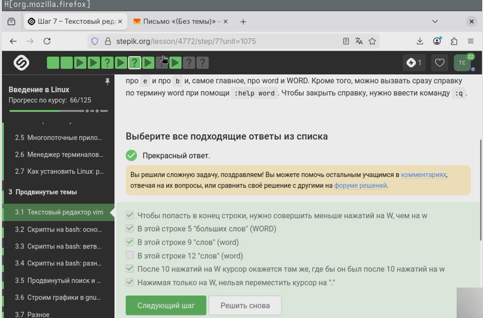{#fig-02}

(ddithree four four four five<Esc>) — самый прямой: удалить всю строку и вставить новую.
(d2w$bifour four <Esc>) — удалить первые два слова, перейти в конец строки, вернуться на начало последнего слова и вставить перед ним два four.
(d2wwywPp) — удалить первые два слова, перейти на слово four, скопировать его и вставить копию перед оригиналом, получив два four подряд, затем повторить.
Остальные варианты приводят к ошибочному результату ([рис. @fig-03]).

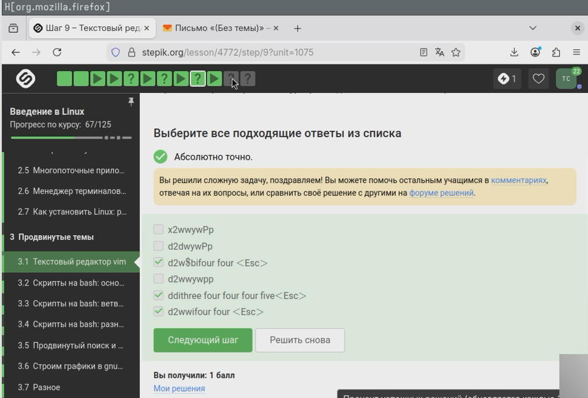{#fig-03}

:%s — замена во всех строках, шаблон Windows, замена Linux. Без флага g заменяется только первое вхождение в строке. Enter не входит в команду ([рис. @fig-04]).

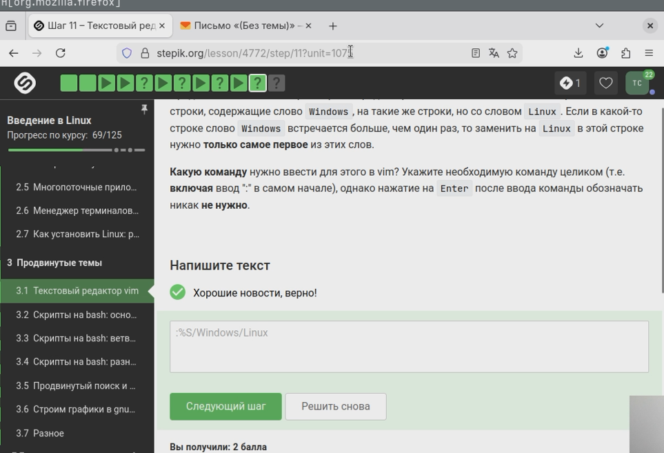{#fig-04}

Режим Visual включается v (из нормального, не из любого). Выход — Esc, не :q. Команда :visual не включает его ([рис. @fig-05]).

{#fig-05}

## Скрипты на bash: основы

История команд привязана к текущей оболочке. Запуск новой оболочки (sh, затем bash) даёт новую историю ([рис. @fig-06]).

{#fig-06}

Команда cd меняет директорию только внутри скрипта, но файл создаётся в /home/bi/ ([рис. @fig-07]).

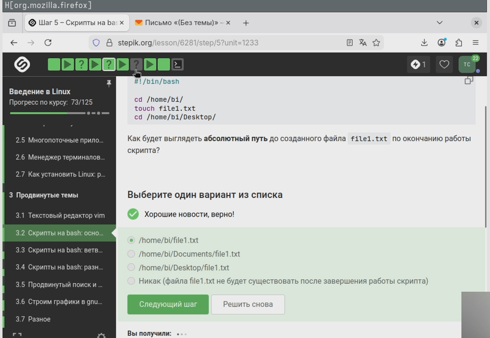{#fig-07}

Имя переменной может содержать буквы, цифры и знак подчёркивания, не может начинаться с цифры. Все перечисленные кроме vari/able (слеш недопустим) подходят ([рис. @fig-08]).

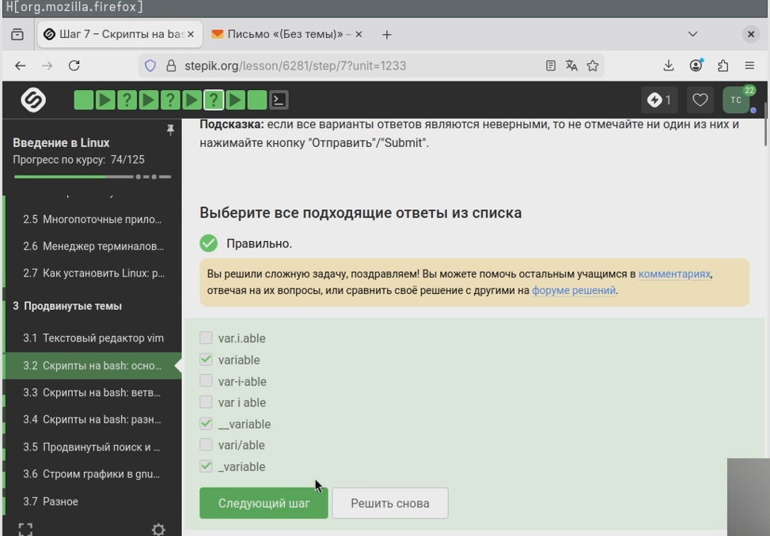{#fig-08}

$1 и $2 — аргументы скрипта. Чтобы вывести символ $ как текст, его нужно экранировать \$. Первый вариант (\$1=$1) выведет $1=значение ([рис. @fig-09]).

{#fig-09}

## Скрипты на bash: ветвления и циклы

Верные: $# -ge 0 — число аргументов всегда >=0 ; -z "" — пустая строка — всегда true ; ! (4 -le 3) — 4≤3 — false, отрицание — true ; 5 -ge 5 — всегда true. Остальные зависят от переменных или аргументов ([рис. @fig-10]).

{#fig-10}

При var=3: первое условие $var -gt 5 — false, второе $var -lt 3 — false, третье $var -eq 4 — false → else → four. При var=5: -gt 5? 5 не больше 5 → false, -lt 3 false, -eq 4 false → снова four ([рис. @fig-11]).

{#fig-11}

Конструкция проверяет число студентов и выводит нужное сообщение. Для 2–4 выводится число с "students". Для 0 особая строка. Для 5 и больше — "A lot of students" ([рис. @fig-12]).

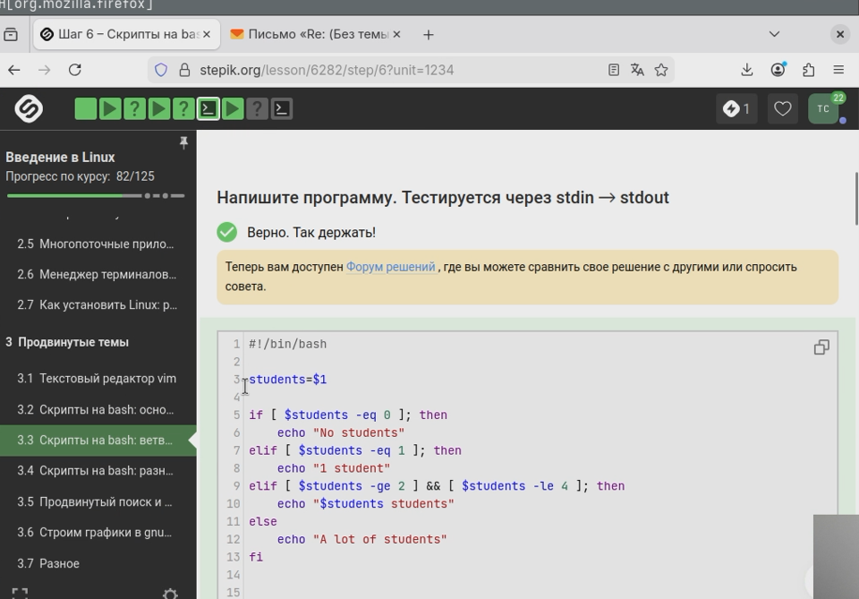{#fig-12}

Цикл for перебирает три строки: "a,", "b," и "c_d". continue пропускает вывод "finish" для строк, которые лексикографически больше "c". "c_d" > "c", поэтому для неё "finish" не выводится. Остальные строки выводят и "start", и "finish". Итог: "start" — 5 раз, "finish" — 4 раза ([рис. @fig-13]).

{#fig-13}

Бесконечный цикл while true. При пустом имени или возрасте 0 — выход с bye. Иначе определение группы ([рис. @fig-14]).

{#fig-14}

## Скрипты на bash: разное

let выполняет арифметику. Пробелы в кавычках допустимы. a+=b — сокращённая запись ([рис. @fig-15]).

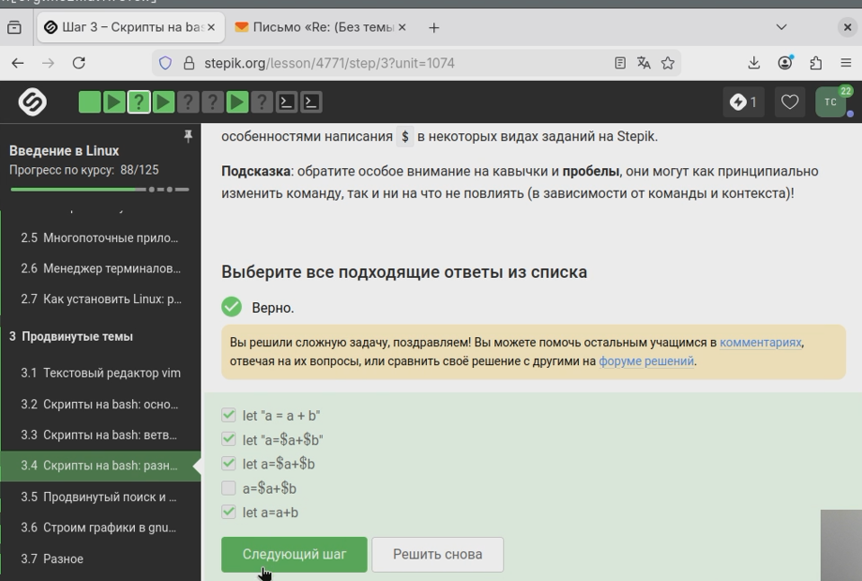{#fig-15}

Команда echo "pwd" выводит строку pwd, а не результат выполнения pwd. Кавычки означают текстовую строку ([рис. @fig-16]).

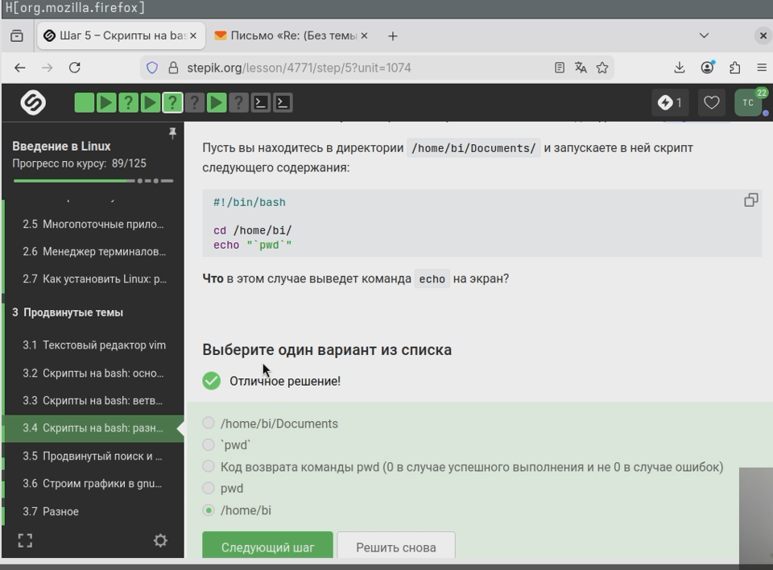{#fig-16}

Чтобы проверить код возврата программы, которая пишет в stdout, нужно либо перенаправить её вывод (чтобы он не попал в условие if), либо явно проверить переменную $? после её выполнения. Остальные способы либо некорректны, либо проверяют вывод, а не код возврата ([рис. @fig-17]).

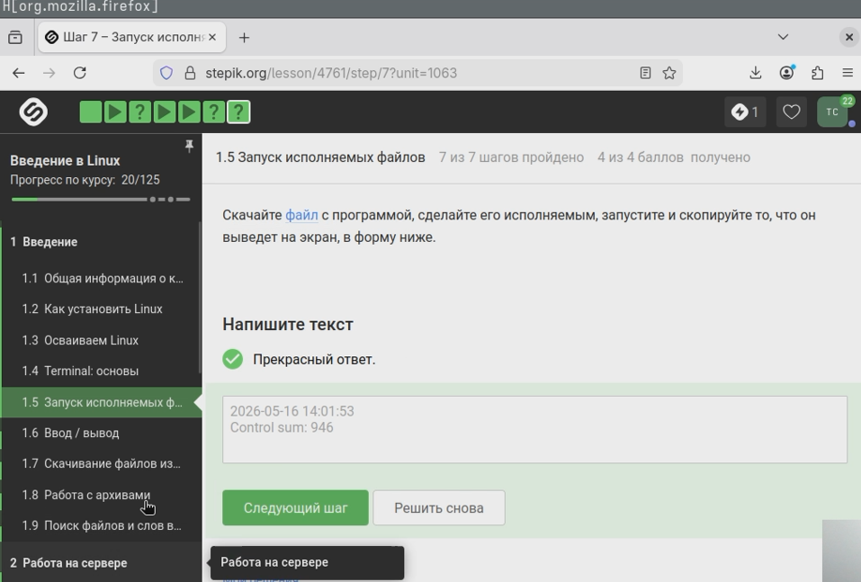{#fig-17}

В функции counter переменная c1 объявлена как local, поэтому её значение не сохраняется между вызовами — после десяти вызовов c1 остаётся пустой. Нелокальная переменная c2 накапливает сумму: 2*(1+2+…+10)=110. Команда echo выводит "counters are and 110" (между are и and — два пробела) ([рис. @fig-18]).

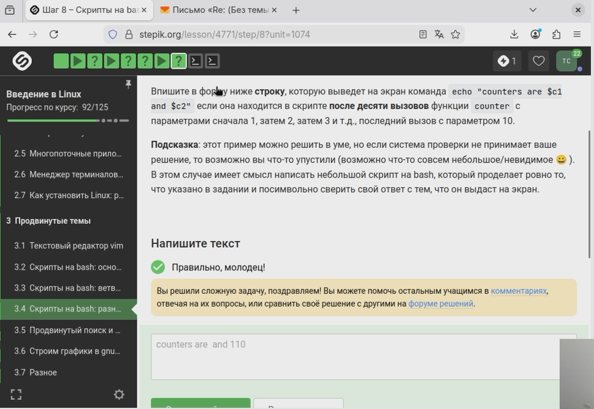{#fig-18}

Бесконечный цикл чтения двух чисел. Пустая строка — выход. Функция gcd реализует алгоритм Евклида ([рис. @fig-19]).

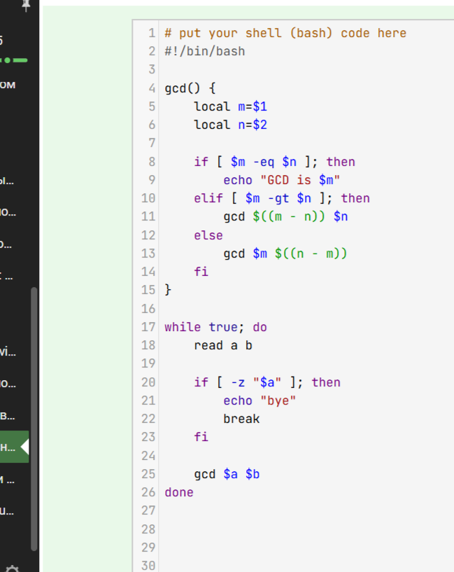{#fig-19}

$((exp)) вычисляет арифметическое выражение. Если выражение неверно — ошибка и выход. exit — выход с bye ([рис. @fig-20]).

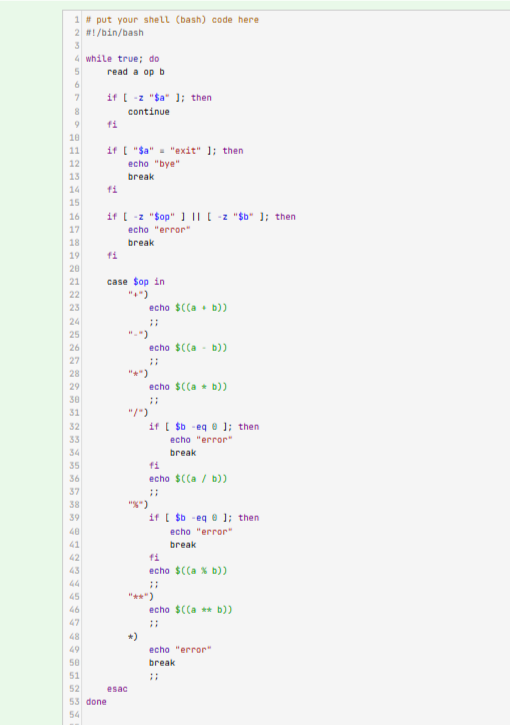{#fig-20}

## Продвинутый поиск и редактирование

-iname ищет без учёта регистра, -name — с учётом ([рис. @fig-21]).

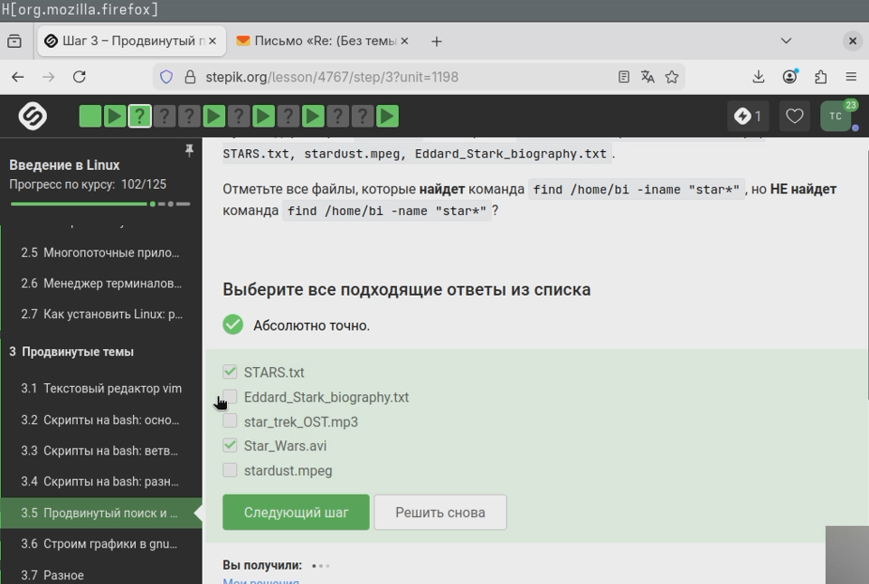{#fig-21}

-path ищет по полному пути, -name только по имени. В некоторых случаях (файл в текущей директории) результат совпадёт, но не всегда ([рис. @fig-22]).

{#fig-22}

Команда find с параметрами -mindepth 2 -maxdepth 3 ищет файлы на глубине 2 и 3 относительно /home/bi/.
file1 находится на глубине 2 (/home/bi/dir1/file1), file2 — на глубине 3 (/home/bi/dir1/dir2/file2), file3 — на глубине 4 (/home/bi/dir1/dir2/dir3/file3).
Будут найдены file1 и file2 — все, кроме file3 ([рис. @fig-23]).

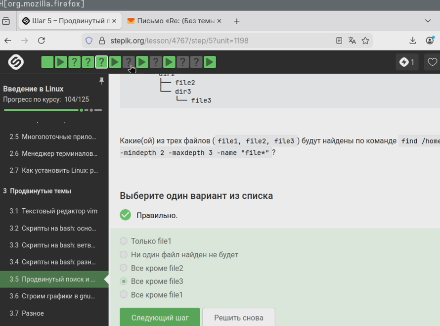{#fig-23}

Во всех вариантах grep выводит одинаковое количество строк, так как каждая строка файла содержит слово "word". Опции -A, -B, -C добавляют контекст, но поскольку искомая строка есть в каждой строке, добавленные строки контекста совпадают с уже выводимыми. В итоге все команды создадут файл results.txt одинакового размера ([рис. @fig-24]).

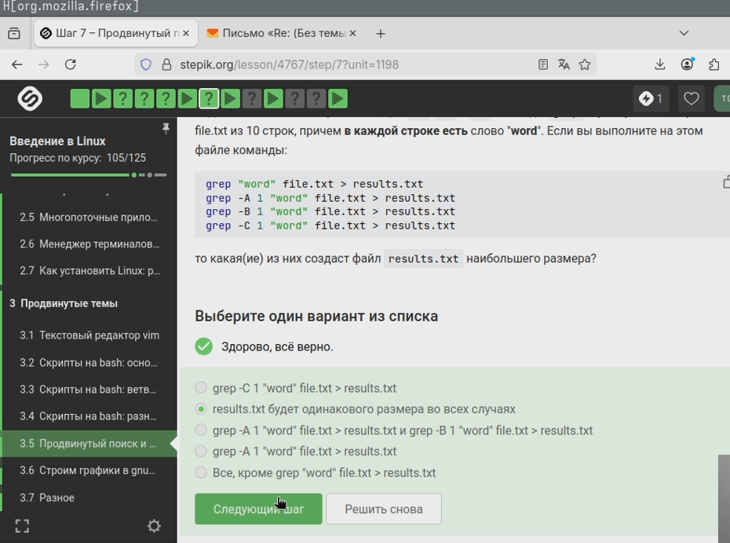{#fig-24}

Регулярное выражение ищет строки, которые оканчиваются на buntu. Перед buntu может быть буква u или цифра 0, а перед ними — необязательный символ из указанного набора. Строка Ubuntu! не подходит из-за восклицательного знака в конце, а Kbuntu — потому что после K идёт b, а не u или 0 ([рис. @fig-25]).

{#fig-25}

Без опции -n sed печатает каждую строку по умолчанию, а команда p печатает её ещё раз. Строки, соответствующие шаблону [a-z]* (хотя бы одна строчная буква), выводятся дважды. Если строка не соответствует шаблону — печатается один раз ([рис. @fig-26]).

{#fig-26}

[A-Z]\{2,\} — две и более заглавные буквы. g — глобально. Пробелы сохраняются, т.к. мы заменяем только саму аббревиатуру ([рис. @fig-27]).

{#fig-27}

## Строим графики в gnuplot

Опция -p (--persist) в gnuplot предотвращает закрытие окон с графиками после завершения программы. Это удобно, когда нужно просмотреть график после выхода из gnuplot ([рис. @fig-28]).

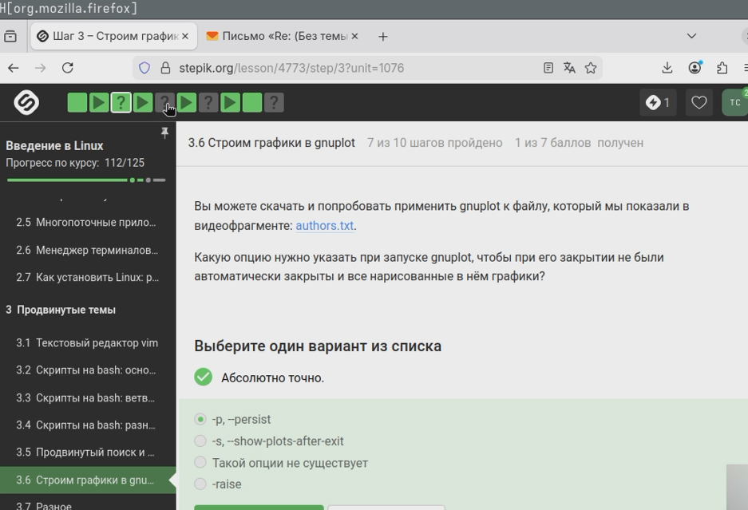{#fig-28}

Опция columnhead интерпретирует первую строку файла как заголовок. Если в первой строке находятся данные, то: Значение из первого столбца (или второго, в зависимости от using) становится названием ряда ; Сама эта строка в построении графика не участвует, поэтому точек становится на одну меньше, чем строк в файле ([рис. @fig-29]).

{#fig-29}

Команда set xtics создаёт пользовательские деления на оси X. Конкатенация строк выполняется через точку. Например, "point 1, value " . x1 при x1=0 даёт "point 1, value 0", после чего указывается координата x1. В итоге получаются три метки в нужных местах ([рис. @fig-30]).

{#fig-30}

Для отражения графика относительно горизонтальной плоскости функция изменена с x^2+ y^2 на -x^2- y^2. Обратное вращение достигается изменением приращения угла: zrot = (zrot + 350) % 360 (350 эквивалентно -10). Ускорение в два раза — уменьшением паузы с 0.2 до 0.1 секунды ([рис. @fig-31]).

{#fig-31}

## Разное

764 в восьмеричной: 7=rwx, 6=rw-, 4=r--. Итог: rwxr-xr--. Другие варианты либо неверные, либо последовательности команд дают другой результат ([рис. @fig-32]).

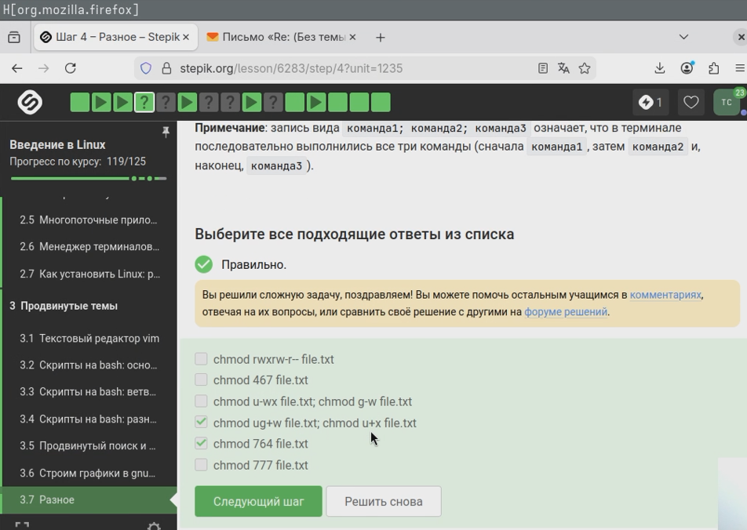{#fig-32}

Чтобы пользователь мог создавать файлы в директории, которая ему не принадлежит, нужно либо сделать его владельцем (chown), либо дать право на запись для его категории пользователей (g+w, если он в группе, или o+w, если он в категории "остальные"). В данном случае sudo chmod o+w dir даёт право на запись всем, включая нужного пользователя, поэтому этот вариант также верен ([рис. @fig-33]).

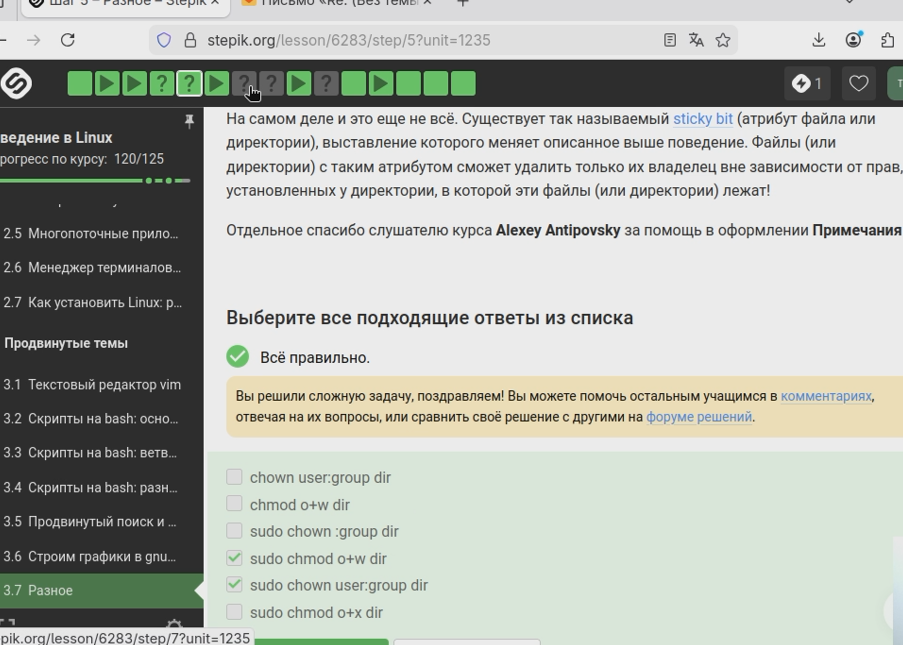{#fig-33}

wc считает длину самой длинной строки (-L), размер в байтах (-c), количество строк (-l), но не считает буквы и предложения ([рис. @fig-34]).

{#fig-34}

Команда du -sh (или du -h -s) выводит суммарный размер текущей директории в человеко-читаемом формате (например, 2.4M). Опция -s (summary) показывает только общий размер, без перечисления файлов ([рис. @fig-35]).

{#fig-35}

Самая короткая команда для создания трёх поддиректорий — mkdir dir{1..3}. Фигурные скобки в Bash генерируют последовательность: dir1, dir2, dir3 ([рис. @fig-36]).

{#fig-36}

# Выводы

Прошла Модуль 3 курса stepik "Введение в Linux!"
