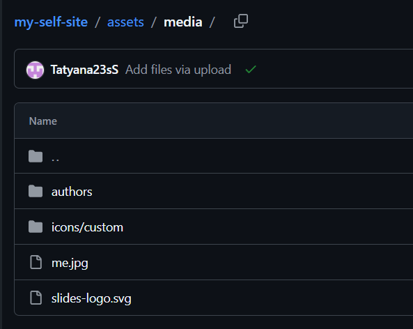
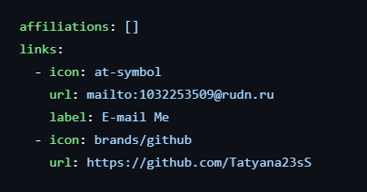
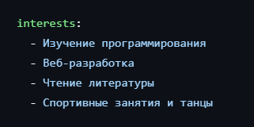
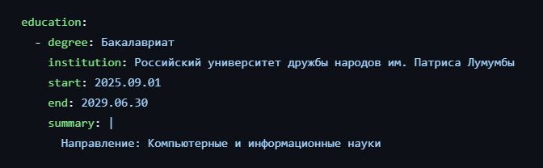
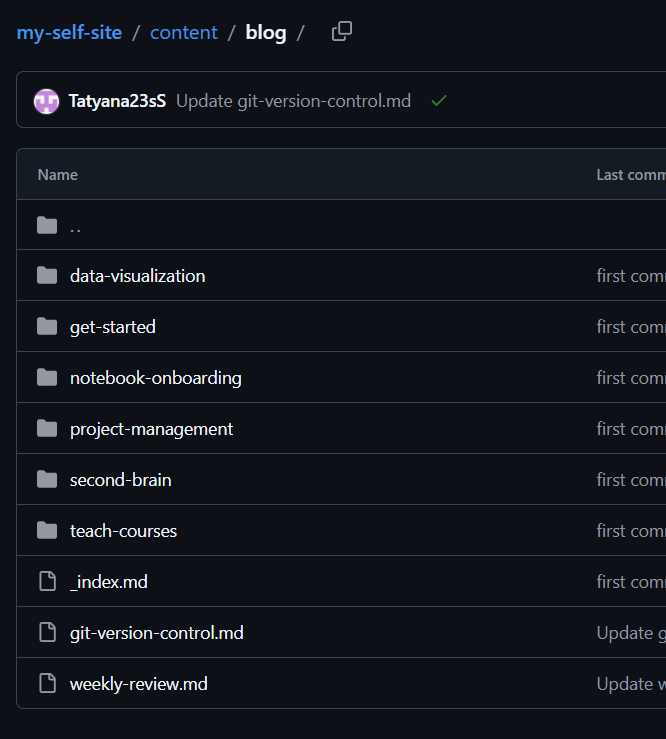
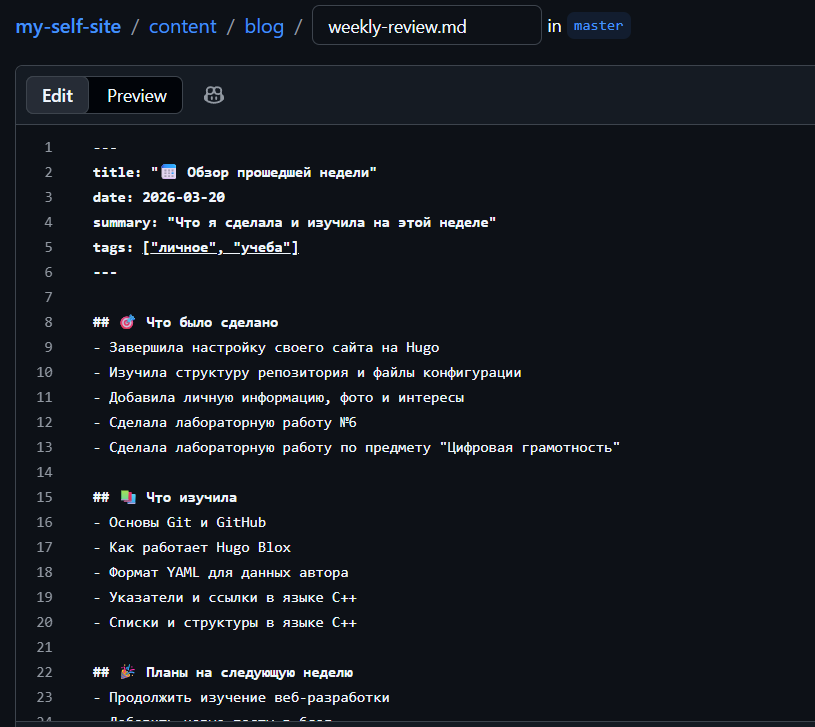
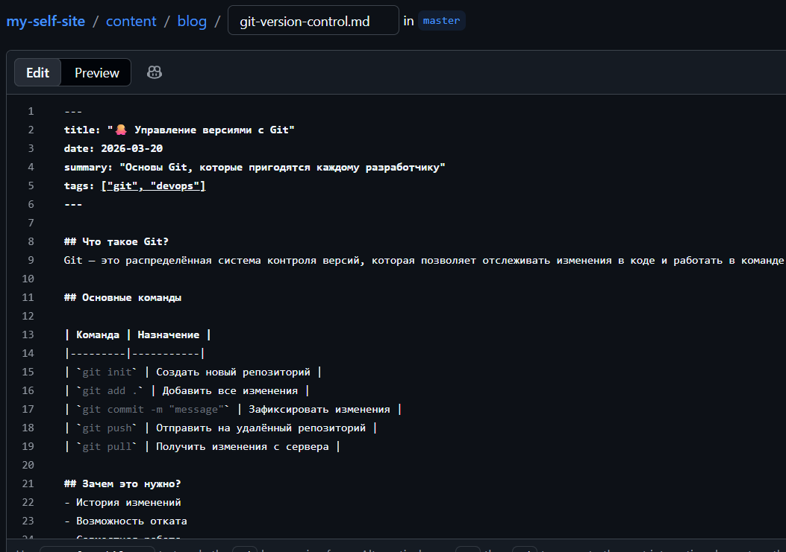

---
## Author
author:
  name: Семенченко Татьяна Сергеевна
  email: 1032253509@rudn.ru
  affiliation:
    - name: Российский университет дружбы народов
      country: Российская Федерация
      postal-code: 117198
      city: Москва
      address: ул. Миклухо-Маклая, д. 6
## Title
title: Индивидуальный проект. Этап 2
subtitle: Добавление персональных данных и постов на сайт.
license: CC BY
date: today
date-format: "YYYY-MM-DD" 
---

# Информация

## Докладчик

:::::::::::::: {.columns align=center}
::: {.column width="70%"}

  * Семенченко Татьяна Сергеевна
  * студент, НКАбд-05-25, 1032253509
  * факультет физико-математических и естественных наук
  * Российский университет дружбы народов им. П. Лумумбы

:::
::: {.column width="30%"}

:::
::::::::::::::

# Выполнение индивидуального проекта 

## Размещение фотографии владельца сайта

{#fig-01}

## Добавление информации о владельце сайта 

{#fig-02}

## Добавление информации о ссылках 

{#fig-03}

## Добавление информации об интересах 

{#fig-03}

## Добавление информации об образовании 

{#fig-05}

## Создание файлов про пост по прошедшей неделе и поста на выбранную тему 

{#fig-06}

## Создание поста по прошедшей неделе 

{#fig-07}

## Создание поста по на выбранную тему 

{#fig-08}

# Выводы

В ходе выполнения второго этапа индивидуального проекта на сайт добавлена персональная информация и два тематических поста.
