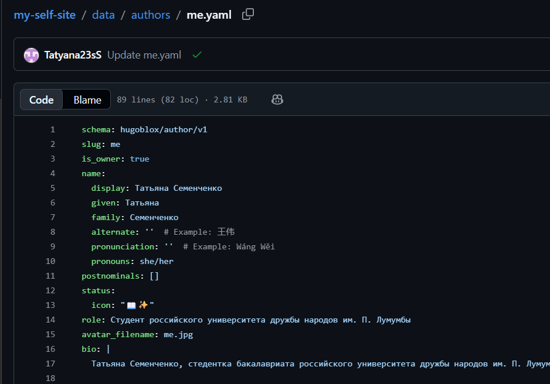

---
## Author
author:
  name: Семенченко Татьяна Сергеевна
  email: 1032253509@rudn.ru
  affiliation:
    - name: Российский университет дружбы народов
      country: Российская Федерация
      postal-code: 117198
      city: Москва
      address: ул. Миклухо-Маклая, д. 6

## Title
title: "Отчёт по второму этапу индивидуального проекта"
subtitle: "Архитектура компьютера и операционные системы"
license: "CC BY"
---

# Цель работы

Добавить к сайту персональные данные: фотографию, биографию, информацию об интересах и образовании, а также опубликовать два поста.
 
# Задание
 
1. Разместить фотографию владельца сайта.
2. Разместить краткое описание владельца сайта (Biography).
3. Добавить информацию об интересах (Interests).
4. Добавить информацию об образовании (Education).
5. Сделать пост по прошедшей неделе.
6. Добавить пост на тему "Управление версиями. Git" или "Непрерывная интеграция и непрерывное развертывание (CI/CD)".

# Выполнение индивидуального проекта

## Размещение фотографии владельца сайта ([рис. @fig-01]).

{#fig-01}

## Добавление информации о владельце сайта ([рис. @fig-02]).

{#fig-02}

{#fig-03}

## Добавление информации об интересах ([рис. @fig-04]).

{#fig-03}

## Добавление информации об образовании ([рис. @fig-05]).

{#fig-05}

## Создание файлов про пост по прошедшей неделе и поста на выбранную тему ([рис. @fig-06]).

{#fig-06}

## Создание поста по прошедшей неделе ([рис. @fig-07]).

{#fig-07}

## Создание поста по на выбранную тему ([рис. @fig-08]).

{#fig-08}

# Выводы

В ходе выполнения второго этапа индивидуального проекта на сайт добавлена персональная информация и два тематических поста.

