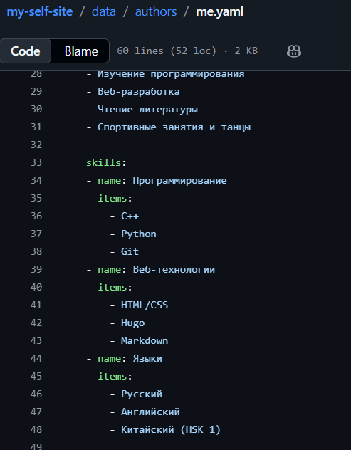
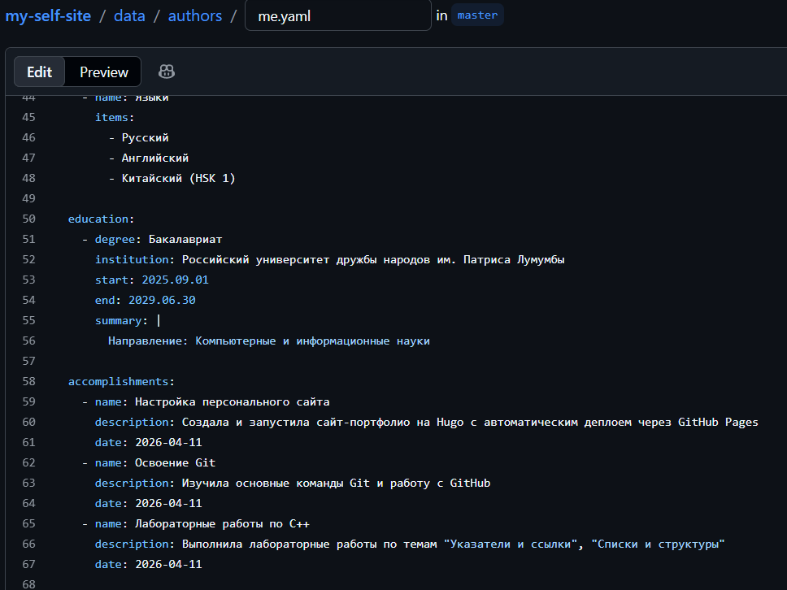
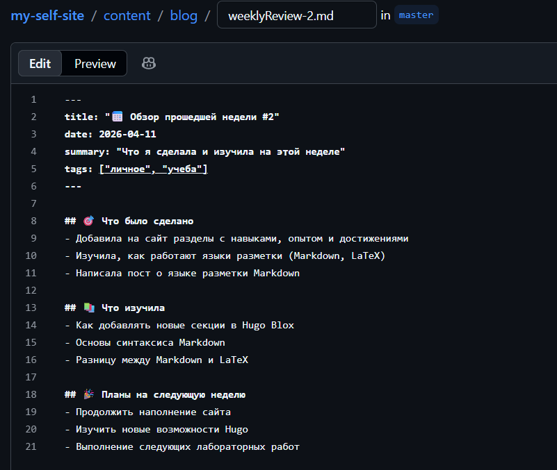

---
## Author
author:
  name: Семенченко Татьяна Сергеевна
  email: 1032253509@rudn.ru
  affiliation:
    - name: Российский университет дружбы народов
      country: Российская Федерация
      postal-code: 117198
      city: Москва
      address: ул. Миклухо-Маклая, д. 6
## Title
title: Индивидуальный проект. Этап 3
subtitle: Добавление информации о навыках, опыте, достижениях 
license: CC BY
date: today
date-format: "YYYY-MM-DD" 
---

# Информация

## Докладчик

:::::::::::::: {.columns align=center}
::: {.column width="70%"}

  * Семенченко Татьяна Сергеевна
  * студент, НКАбд-05-25, 1032253509
  * факультет физико-математических и естественных наук
  * Российский университет дружбы народов им. П. Лумумбы
 
:::
::: {.column width="30%"}

:::
::::::::::::::

# Цель работы

Добавить к сайту достижения: информацию о навыках, опыте, достижениях и выложить два поста.

# Задание

1. Добавить информацию о навыках (Skills).
2. Добавить информацию об опыте (Experience).
3. Добавить информацию о достижениях (Accomplishment).
4. Сделать пост по прошедшей неделе.
5. Добавить пост на тему "Язык разметки Markdown".

# Выполнение индивидуального проекта

## Добавление информации о навыках

{#fig-01}

## 2. Добавление информации об опыте

{#fig-02}

## 3. Добавление информации о достижениях

{#fig-03}
 
## 4. Создание поста по прошедшей неделе

{#fig-04}
 
## 5. Создание поста на тему "Язык разметки Markdown"

{#fig-05}
 
# Выводы
 
В ходе выполнения третьего этапа индивидуального проекта на сайт добавлена информация о навыках и опыте, а также два тематических поста. 
