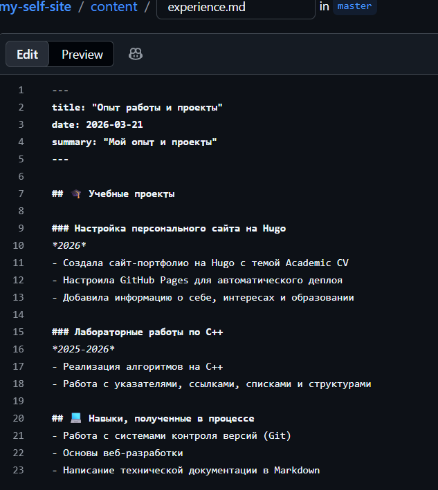
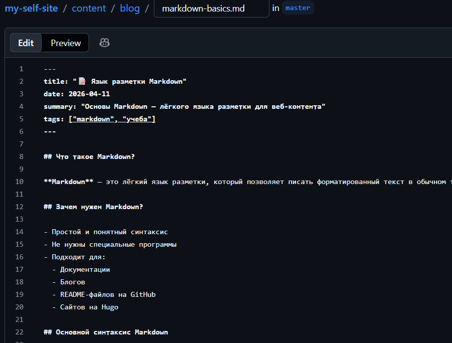

---
## Author
author:
  name: Семенченко Татьяна Сергеевна
  email: 1032253509@rudn.ru
  affiliation:
    - name: Российский университет дружбы народов
      country: Российская Федерация
      postal-code: 117198
      city: Москва
      address: ул. Миклухо-Маклая, д. 6

## Title
title: "Индивидуальный проект. Этап 3"
subtitle: "Архитектура компьютеров и операционные системы"
license: "CC BY"
---

# Цель работы

Добавить к сайту достижения: информацию о навыках, опыте и выложить два поста.

# Задание

1. Добавить информацию о навыках (Skills).
2. Добавить информацию об опыте (Experience).
3. Добавить информацию о достижениях (Accomplishment).
4. Сделать пост по прошедшей неделе.
5. Добавить пост на тему "Язык разметки Markdown".

# Выполнение индивидуального проекта

## Добавление информации о навыках

Добавила в файл информацию о навыках ([рис. @fig-01]).

{#fig-01}

## 2. Добавление информации об опыте
 
В раздел Experience добавлена информация о профессиональном опыте ([@fig-02]).

{#fig-02}

## 3. Добавление информации о достижениях

Добавила в файл информацию о достижениях ([рис. @fig-03]).

{#fig-03}
 
## 4. Создание поста по прошедшей неделе
 
Создан пост, описывающий события прошедшей недели ([рис. @fig-04]).

{#fig-04}
 
## 5. Создание поста на тему "Язык разметки Markdown"
 
Создан пост, в котором рассказано об основах языка разметки Markdown, его синтаксисе и возможностях ([рис. @fig-05]).

{#fig-05}
 
# Выводы
 
В ходе выполнения третьего этапа индивидуального проекта на сайт добавлена информация о навыках и опыте, а также два тематических поста.

